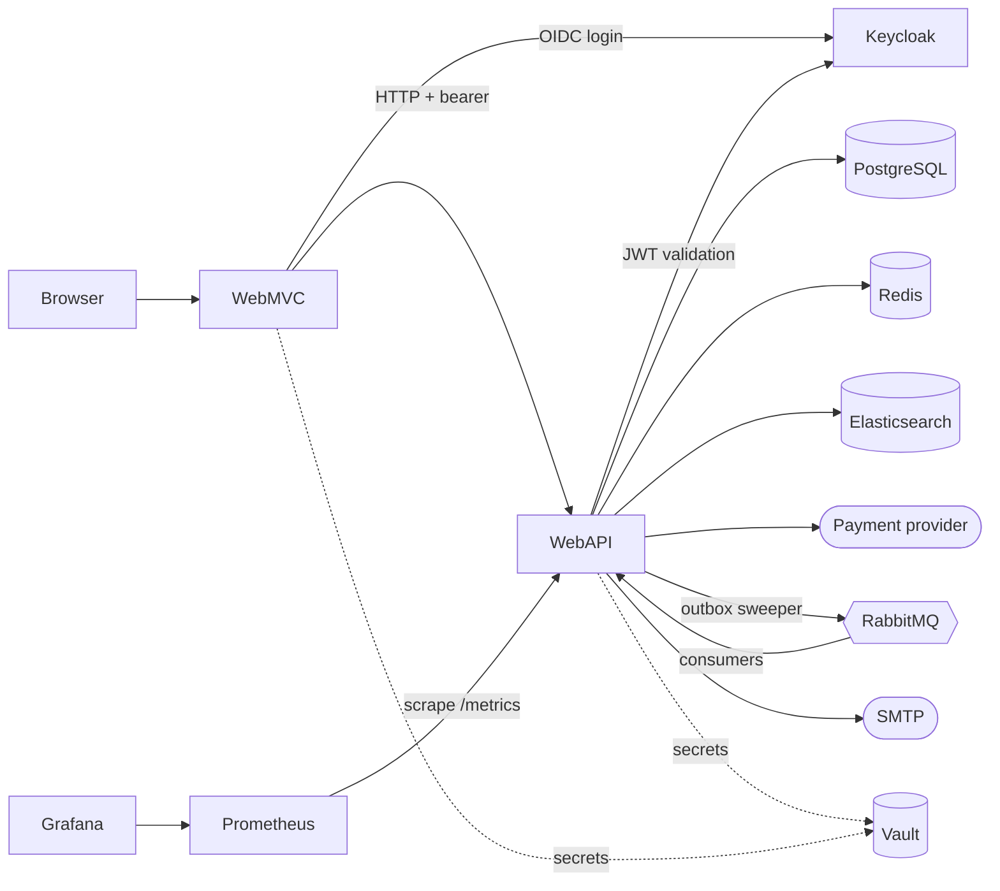
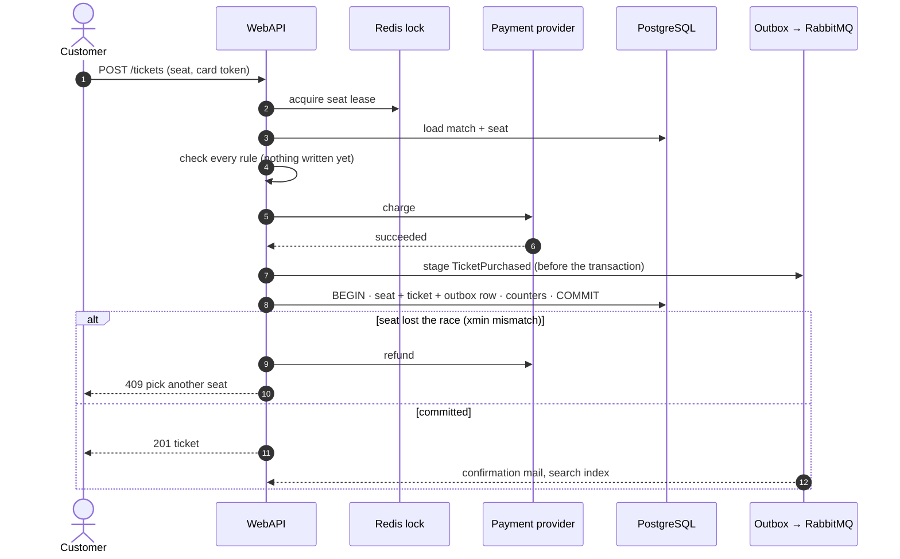

# 🎟️ StadiaPass

**English** · [Türkçe](README.tr.md)

   

Stadium and arena ticketing, built as a reference-grade Clean Architecture solution: Minimal API backend,
Razor MVC front end, DDD domain model, CQRS with MediatR, Keycloak-backed dynamic permissions, Elasticsearch
behind the search box, and .NET Aspire orchestration.

## 🎯 What it is

Matches belong to a sport category and are opened against a venue seating plan. A visitor finds a fixture by
name or picks it off the listing, chooses a seat on an interactive map, the seat is held for them, and paying
turns that hold into a ticket. An official can call a fixture off, and the money goes back on its own.

**Almost everything interesting here is in those two sentences.** Two people want the same seat. Money moves
at a company on the other side of the internet. The things that happen afterwards — the confirmation mail, the
search index, the counters — must not be able to fail the checkout. And when a match is cancelled, hundreds of
refunds have to be issued against a provider that can refuse, rate-limit, or simply be slow.

| | |
|---|---|
| **Seat contention** | The seat carries a `xmin` concurrency token, so two sales of one seat cannot both commit. The loser's card is refunded automatically. |
| **Money that must not be lost** | A charge that lands while the sale rolls back is compensated; if the refund itself fails it is written to a durable ledger the broker retries. |
| **Nothing downstream can fail checkout** | Mail, search indexing and announcements leave through a transactional outbox, written by the same `SaveChanges` as the sale. |
| **Cancelling a fixture** | Selling stops in one small transaction; every sold ticket is then settled one at a time off the broker, each with its own retry. |
| **Search that degrades** | Elasticsearch is a convenience over a system that sells tickets perfectly well without it. If the cluster is gone, the search box hands back the listing and says so. |

## 📸 Screenshots

### Storefront

| Match listing — live seat counts per fixture | Search — Turkish analyzer, typo-tolerant |
|---|---|
|  |  |

| Seat map — free / held / sold / yours | Checkout — declined card keeps the hold, countdown runs |
|---|---|
|  |  |

| My tickets — the perforated stub, access code, price snapshot |
|---|
|  |

### Back office

| Fixtures on sale — cancelling one refunds every ticket | Roles & permissions — the checklist is rendered from the permission catalogue by reflection |
|---|---|
|  |  |

<details>
<summary><b>More back-office screens</b> — venues and seating plans, categories, users, and the create forms</summary>
<br>

| Venues — blocks, price multipliers, frozen plans | New venue — the seating plan a match materialises |
|---|---|
|  |  |

| Sport categories — which venue kinds each plays in | New category |
|---|---|
|  |  |

| Create match — the venue's whole plan becomes seats | New role — permissions ticked here become Keycloak composites |
|---|---|
|  |  |

| Users — accounts live in Keycloak, brokered via the API | New user |
|---|---|
|  |  |

</details>

## 🏗️ Architecture

```
StadiaPass.slnx
├── src
│   ├── Shared
│   │   ├── StadiaPass.SharedKernel            # permission vocabulary, no framework dependency
│   │   └── StadiaPass.SharedKernel.AspNetCore # dynamic policy provider + claims transformation
│   ├── Core
│   │   ├── StadiaPass.Domain        # aggregates, value objects, domain events
│   │   └── StadiaPass.Application   # CQRS use cases, validation, ports
│   ├── Infrastructure
│   │   ├── StadiaPass.Persistence   # EF Core 10 + PostgreSQL, outbox/inbox, repositories
│   │   └── StadiaPass.Infrastructure# adapters: payments, messaging, search, mail, locking
│   └── Presentation
│       ├── StadiaPass.WebAPI        # Minimal API + Scalar reference
│       └── StadiaPass.WebMVC        # Razor MVC — consumes the API over HTTP only
├── orchestrator
│   ├── StadiaPass.AppHost           # Aspire: Postgres, Redis, RabbitMQ, Keycloak, Elastic, Vault, Grafana
│   └── StadiaPass.ServiceDefaults   # Vault config, Serilog, OpenTelemetry, health checks
└── tests                            # Domain.UnitTests · Application.UnitTests
```

```
WebMVC ──HTTP──► WebAPI ──► Application ──► Domain
   │                │            ▲
   │                └──► Persistence / Infrastructure (implement the abstractions)
   └──────────────► SharedKernel ◄── WebAPI          (permission contracts only)
```

`Domain` depends on nothing but `MediatR.Contracts` (marker interfaces). `WebMVC` never references `Domain`
or `Application` — it is a pure API consumer, exactly like a third-party client. The only thing it shares with
the API is the permission vocabulary, which lives in `SharedKernel` so neither side can invent a permission
string of its own.



### Domain model

| Aggregate | Invariants it enforces |
|---|---|
| `SportCategory` | at least one playable venue kind, unique name, an inactive category accepts no new match |
| `Venue` | at least one block, unique block names, capped at 25 000 seats, plan frozen once a match uses it |
| `Match` | teams differ, kick-off in the future, category playable in the venue kind, seats materialised from the plan, counters and `SoldOut` kept consistent, **no seat traded once kick-off passes** |
| `MatchSeat` | `Available` → `Reserve()` → `ConfirmSale()`, 10-minute hold, only the holder may buy, expired holds auto-release, `VoidSale()` is the one way back out of `Sold` |
| `Ticket` | issued only for a seat the match has already moved to `Sold`, always records the charge that paid for it, at most one live ticket per seat |

Seat transitions are driven **only** through the match: `MatchSeat.Reserve/ConfirmSale/Release` are
`internal`, so `Match.ReserveSeat(...)` and `Match.ConfirmSeatSale(...)` are the sole entry points and the
counters can never drift from the seats. Every setter is `private`; rule violations throw
`DomainRuleViolationException`, which the API maps to `422`.

## 🎫 Buying a seat



The order is the whole design. The rules run **before** the card is touched, because charging someone and only
then discovering their hold had expired leaves them paid up and seatless. The counters are computed by the
database (`sold = sold + 1`) and written **last** — the match row is the coarsest lock in the system, so it is
held for the commit alone rather than across the whole transaction; measured under contention, taking it last
was **1.9×** the throughput of taking it first. And when the money moved but the sale did not, the refund runs
before the error travels: if the refund itself fails, a `RefundOwedEvent` goes on the outbox and the broker
retries it — a debt is a row, not a log line somebody has to notice.

## 🔥 Calling a fixture off

```
CancelMatchCommand ── one small transaction: status=Cancelled · release held seats · 2 outbox rows
        │
        ├─► MatchCatalogueChangedEvent ──► the fixture leaves the search index
        │
        └─► MatchCancelledEvent ──► one scope per sold ticket, off the broker:
                void seat · cancel ticket · owe refund · queue the notice   (one transaction each)
                        └─► provider refund  +  "your money is on its way" mail
```

The synchronous half is deliberately tiny: it shuts the till and hands back held seats, nothing more. Paying
back hundreds of tickets belongs on the broker, where each ticket retries on its own and a provider having a
bad afternoon cannot roll back the cancellation. Every settlement is addressed by its payment and only ever
finds a ticket that is still live, so redelivery is a no-op and a half-finished pass simply resumes.

## 📐 Architectural decisions

Every row is a decision that cost something, and most of them exist because of a defect that was measured
rather than imagined.

| Decision | Why | What it prevents |
|---|---|---|
| **Domain depends on nothing** | Rules are testable without a database, a broker or a web host | 57 domain tests run in 60 ms and cannot be broken by infrastructure |
| **WebMVC talks to the API over HTTP only** | Proves the API is a real contract rather than a convenience for one caller | A front end quietly reaching into `Application` and making the API decorative |
| **Optimistic concurrency (`xmin`) on the seat** | Two sales of one seat cannot both commit | Double-selling a seat; the loser is refunded automatically |
| **Counters as relative `UPDATE`s, match row last** | The database computes the totals, not the request | Lost updates, and a lock convoy — measured at 1.9× throughput |
| **Redis lease at the door of checkout** | Turns the loser away before the card is charged | A charge and a refund on somebody's statement for a seat they were never getting |
| **Transactional outbox** | Message and sale share one `SaveChanges` | A ticket sold with nobody downstream ever told; or a mail about a sale that rolled back |
| **Inbox for provider webhooks** | Providers deliver at least once | A duplicated webhook refunding twice |
| **Idempotency key names the attempt, not the seat** | Providers refuse a reused key with different parameters | The first card ever tried deciding the answer for every later card — and locking the seat for 24 hours |
| **The card never reaches storage** | Only a provider token is charged; card fields are masked in every log | The whole of PCI scope that storing a PAN would drag in |
| **Elasticsearch for search only** | The listing stays in PostgreSQL and is never stale | A read model disagreeing with the seat map; a search outage becoming a site outage |
| **`asciifolding` before the Turkish stemmer** | Otherwise `Fenerbahçe` and `fenerbahce` stem differently | A visitor without Turkish characters finding nothing |
| **Kick-off closes sales, by clock not status** | A status needs something to set it, and that thing can be late | Selling a ticket for a match that has already been played |
| **Cancelling has its own permission** | It is the only action that spends money | Whoever may open a match automatically being able to refund a stadium |
| **Keycloak holds the roles; code holds the permissions** | Role names live in the realm, permission strings in `SharedKernel` | Two sides inventing different spellings of the same right |
| **Vault for secrets, no fallbacks** | Secret-bearing options are `[Required]` + `ValidateOnStart` | A default that keeps quietly working after someone forgets to configure it |

### Deliberately not done

| Not done | Why |
|---|---|
| **Saga / process manager** | Two participants — the provider and one PostgreSQL transaction — and seat, counter and ticket are already atomic. A saga would add a coordinator without a consistency problem left for it to solve, and would cost the synchronous `201`/`409` answers the client depends on. |
| **Facets / aggregations in search** | The analyzer, relevance and typo tolerance were the point; faceting is more Elasticsearch surface without more to learn from it. |
| **Hangfire / Quartz** | A handful of periodic jobs do not justify a scheduler and its storage; single-instance execution is already settled by `FOR UPDATE SKIP LOCKED`. |
| **Kubernetes manifests** | `/health` and `/alive` already answer the two questions an orchestrator asks; a manifest written against no cluster is wrong in ways nothing can tell you. |
| **Tests on eight thin handlers** | They forward one call to a repository; a test would assert that a mock was called and lock the implementation without being able to catch a defect. |
| **A time zone model** | Written and read with the server's local time — symmetric, but in a `TZ=UTC` container a Turkish visitor sees times three hours out. Known, accepted. |

## 🛠️ Technology stack

| Layer | Technology | Version | What it does here |
|---|---|---|---|
| Runtime | .NET / C# | 10 / 14 | `warnings-as-errors`, nullable enabled solution-wide |
| Orchestration | .NET Aspire | 13.5.2 | starts every dependency, wires connection strings, dashboard |
| API | ASP.NET Core Minimal API | 10.0.11 | `MapGroup` + `IEndpoint` discovery, Scalar reference UI |
| UI | ASP.NET Core MVC + Razor | 10.0.11 | server-rendered, one hand-written stylesheet |
| Use cases | MediatR + FluentValidation | 12.5.0 / 12.1.1 | commands, queries, pipeline behaviours |
| Persistence | EF Core + Npgsql → PostgreSQL 17 | 10.0.11 | aggregates, owned types, `xmin` token, outbox and inbox tables |
| Cache / locking | Redis | latest | 15-second listing cache, `SET NX PX` seat lease |
| Messaging | MassTransit + RabbitMQ | 8.5.10 | consumers, retry policy (5 attempts, 1 s → 30 s), error queues |
| Search | Elasticsearch | 9.x | Turkish analyzer, search-then-fetch |
| Identity | Keycloak | latest | OIDC login, JWT, realm-held roles |
| Payments | Stripe.NET | 52.3.0 | tokenised charge, refund, signed webhooks |
| Mail | MailKit | 4.17.0 | ticket confirmation, cancellation notice |
| Secrets | HashiCorp Vault | 1.21 | injected as configuration at startup |
| Telemetry | OpenTelemetry + Serilog | 1.15 / 10.0 | traces, metrics, structured logs |
| Dashboards | Prometheus + Grafana | 3.6 / 12.2 | scraped metrics, provisioned panels and alert rules |
| Tests | xUnit, NSubstitute, FluentAssertions | 2.9 / 5.3 / 7.2 | 207 tests |

**Patterns in the code:** Clean Architecture · DDD aggregates · domain events · CQRS · pipeline behaviours ·
repository + unit of work · ports and adapters · transactional outbox · idempotent inbox · compensating
action · optimistic concurrency · distributed lock · search-then-fetch projection · options validation ·
background workers over `PeriodicTimer`.

## 🔐 Security

Authentication is delegated to Keycloak; authorization is **permission-based and fully dynamic** — no role
name appears anywhere in the code.

- `StadiaPassPermissions` (SharedKernel) is the only place a permission string is declared; policies are built
  on demand by a custom policy provider, so `AddPolicy(...)` is never written by hand.
- Keycloak realm roles are composite: a business role such as `BoxOffice` expands into permission roles, and
  the claims transformation drops anything the application does not declare — adding a role in Keycloak
  cannot silently widen access. The role editor in the portal renders the catalogue by reflection, so a new
  permission constant appears as a checkbox with no UI change.
- `Matches.Cancel` is deliberately its own permission and only `Administrator` holds it: it is the one action
  that spends money.
- The card is never stored and never logged — a destructuring policy masks every member whose name looks like
  a secret before any event is written. Only `sk_test_` Stripe keys are accepted, refused at startup otherwise.
- The webhook endpoint is anonymous by necessity and defended entirely by its HMAC signature; anything that
  does not verify is refused, including a missing header.
- Every secret lives in Vault and arrives as ordinary configuration; secret-bearing options have no defaults
  and fail at startup, not at midnight.

## 📊 Observability

Serilog owns logging in both apps (console + OTLP into the Aspire dashboard), one request-log line per
request, with the MediatR command destructured onto every event it produces. Prometheus scrapes `/metrics`
every 5 s and Grafana comes provisioned — data source, dashboard and two alert rules — from files in the
repo, so a fresh clone has working panels.

The numbers written *for this system*, rather than the generic runtime set:

| Metric | Why it needs a person |
|---|---|
| `stadiapass_outbox_dead` / `stadiapass_inbox_dead` | messages the sweeper gave up on. An inbox row is worse: the provider was answered `200` and will never send it again — a chargeback nobody applied. Alert at `> 0`. |
| `stadiapass_outbox_pending` / `inbox_pending` | a broker that is down, a consumer that is broken and a sweeper that stopped all look identical: a count that climbs and does not come back |
| search duration histogram (by `outcome`) | latency and fallback count in one instrument — bucket boundaries spelled out, because .NET's defaults are in milliseconds and read a 20 ms p95 as "5 seconds" |
| indexed vs indexable matches | the one search failure that makes no noise: an index that is *there and empty* answers every query with nothing |

## ✅ Tests

**207 tests** — 57 domain, 150 application — running in about 200 ms with no database, broker or network.

Two things about how they are written are worth more than the number:

- **Real aggregates, mocked ports.** A handler test that stubbed the domain would prove nothing about the
  rule it is supposed to enforce, so the match is built for real and only the repository, the clock, the unit
  of work and the caller are substituted.
- **Every test was proved able to fail.** For each behaviour the production code was deliberately broken and
  the matching test watched failing — the outbox staged after the save, the counter written first, a guard
  inverted, a filter removed. A test that has never failed has not been shown to test anything.

What is **not** covered: the persistence layer, the MVC views, and eight thin forwarding handlers. Those are
exercised by walking the running application — see [Scenarios](#-scenarios).

```powershell
dotnet test
```

## 🚀 Running

Requires the .NET 10 SDK and a container runtime (Docker Desktop or Podman).

```powershell
dotnet run --project orchestrator/StadiaPass.AppHost
```

Aspire starts PostgreSQL (with pgAdmin), Redis (with RedisInsight), RabbitMQ (with the management plugin),
Elasticsearch, Keycloak, Vault, Prometheus, Grafana, the API and the MVC app. On first start the schema is
created and seeded, and the Keycloak realm is imported.

| Resource | Local URL |
|---|---|
| MVC UI | http://localhost:5230 |
| API + Scalar reference | http://localhost:5042 · `/scalar/v1` |
| Keycloak | https://localhost:8080 |
| Vault UI | http://localhost:8200 |
| Prometheus · Grafana | http://localhost:9090 · http://localhost:3000 |
| RabbitMQ, Elasticsearch | ports shown on their resources in the Aspire dashboard |

**Payments need no configuration.** The provider defaults to a mock that follows Stripe's own test numbers, so
`4242 4242 4242 4242` succeeds and `4000 0000 0000 9995` is declined without a key or a network. Set
`PaymentProvider:Type=Stripe` with a `sk_test_…` key to use the real thing.

**A `GET /health responded 503` in the first seconds of a cold start is the system working**, not a fault:
`/health` answers only when every dependency is ready, and RabbitMQ is still coming up while the API is
already listening. `/alive` answers the different question — "is this process still running" — so a broker
hiccup never gets the API restarted.

### Demo users

| User | Password | Role | Can |
|---|---|---|---|
| `mudur` | `mudur` | Administrator | everything, including cancelling a match |
| `organizator` | `organizator` | MatchManager | venues, categories, opening matches |
| `gise` | `gise` | BoxOffice | hold and buy tickets, read anybody's |
| `musteri` | `musteri` | Customer | browse, hold, buy, read own tickets |
| `seyirci` | `seyirci` | Viewer | read only |

## 🎬 Scenarios

Walkthroughs against the running application. Each one exercises something the unit tests cannot.

**1 · Buy a seat.** Open http://localhost:5230, pick a match, pick a seat, sign in as `musteri`/`musteri`,
pay with `4242 4242 4242 4242` · `12/30` · `123`. Expect: a ticket, the perforated stub screen, and that seat
turning to solid ink on the map.

**2 · A declined card keeps the hold.** Hold another seat, pay with `4000 0000 0000 9995`. Expect: "insufficient
funds", and **the seat still held by you** — nothing was written, so there is nothing to undo. Now pay for the
same seat with `4242 4242 4242 4242`. Expect: success. Against a real Stripe key this is the test that matters:
a fixed idempotency key would have replayed the decline and locked the seat for 24 hours.

**3 · Two browsers, one seat.** Hold the same seat in two browsers. Expect: the second is refused at the door
rather than after a charge.

**4 · An abandoned hold comes back.** Hold a seat and walk away. Expect: within a minute of the ten-minute
window expiring, the seat is available again and the counters agree with the map.

**5 · Search.** Type a partial name, a misspelling, and an ASCII spelling of a Turkish name (`fenerbahce`).
Then stop the `search` container and search again. Expect: the listing, in about two seconds, with a note that
search is unavailable — and buying still works.

**6 · Cancel a match.** As `mudur`, go to **Matches**, cancel a fixture that has tickets sold, and give a
reason. Expect: a confirmation page that says how many tickets will be refunded; the fixture gone from the
listing **and from search**; as `musteri`, "My tickets" showing the stub stamped *Match cancelled* with the
amount coming back; and in the API logs, one `settled after a cancellation` and one `Refunded` per ticket.

**7 · A ticket for a match already played.** Keep a seat-map link, wait for kick-off to pass, reopen it.
Expect: the map renders, and nothing can be held or bought.

## 📝 Notes

No remote repository; this is a single-developer solution built to be read. The realm file, the mock payment
provider and the seeded data exist so that `dotnet run` on a fresh clone gives a working ticket shop with
nothing to configure.
