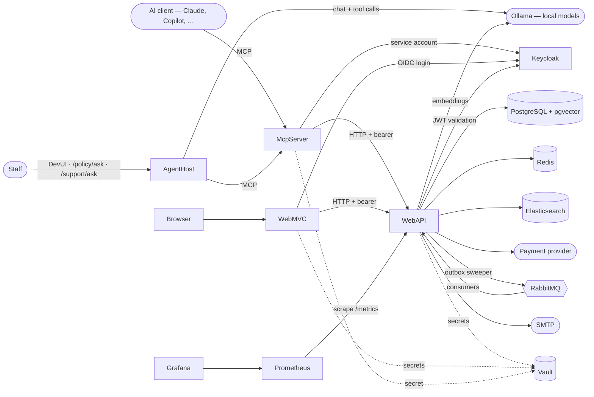
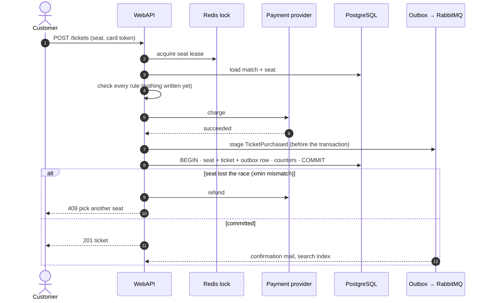

# 🎟️ StadiaPass

**English** · [Türkçe](README.tr.md)

    

Stadium and arena ticketing, built as a reference-grade Clean Architecture solution: Minimal API backend,
Razor MVC front end, DDD domain model, CQRS with MediatR, Keycloak-backed dynamic permissions, Elasticsearch
behind the search box, .NET Aspire orchestration — and an MCP tool layer with two in-house consumers on top
of it: an analyst agent that chooses its tools, and a policy assistant that answers staff from the rule book
with citations (retrieval-augmented generation over pgvector, with query splitting and reranking). A support
desk in front of both routes each question to the right one — or to both at once — as a multi-agent workflow.

## 🎯 What it is

Matches belong to a sport category and are opened against a venue seating plan. A visitor finds a fixture by
name or picks it off the listing, chooses a seat on an interactive map, the seat is held for them, and paying
turns that hold into a ticket. An official can call a fixture off, and the money goes back on its own.

**Almost everything interesting here is in those two sentences.** Two people want the same seat. Money moves
at a company on the other side of the internet. The things that happen afterwards — the confirmation mail, the
search index, the counters — must not be able to fail the checkout. And when a match is cancelled, hundreds of
refunds have to be issued against a provider that can refuse, rate-limit, or simply be slow.

| | |
|---|---|
| **Seat contention** | The seat carries a `xmin` concurrency token, so two sales of one seat cannot both commit. The loser's card is refunded automatically. |
| **Money that must not be lost** | A charge that lands while the sale rolls back is compensated; if the refund itself fails it is written to a durable ledger the broker retries. |
| **Nothing downstream can fail checkout** | Mail, search indexing and announcements leave through a transactional outbox, written by the same `SaveChanges` as the sale. |
| **Cancelling a fixture** | Selling stops in one small transaction; every sold ticket is then settled one at a time off the broker, each with its own retry. |
| **Search that degrades** | Elasticsearch is a convenience over a system that sells tickets perfectly well without it. If the cluster is gone, the search box hands back the listing and says so. |
| **AI without a second source of truth** | The catalogue is published once as MCP tools. Claude and an in-house agent on a local model consume the same tools, over the same API — and the agent's tool selection is scored, not trusted. |
| **Answers that can be checked** | Staff ask the rule book in plain language. The assistant finds the sections that answer each question asked, answers only from them, cites each by number — and says "the documents do not cover this" rather than guess. Retrieval, grounding and refusal are each scored. |
| **One door for every question** | Staff do not have to know which assistant to ask. A router sends a question about matches to the analyst and a question about rules to the policy assistant; a message that asks both goes to both at once, and the two replies come back as one answer. |

## 📸 Screenshots

### Storefront

| Match listing — live seat counts per fixture | Search — Turkish analyzer, typo-tolerant |
|---|---|
|  |  |

| Seat map — free / held / sold / yours | Checkout — declined card keeps the hold, countdown runs |
|---|---|
|  |  |

| My tickets — the perforated stub, access code, price snapshot |
|---|
|  |

### Back office

| Fixtures on sale — cancelling one refunds every ticket | Roles & permissions — the checklist is rendered from the permission catalogue by reflection |
|---|---|
|  |  |

<details>
<summary><b>More back-office screens</b> — venues and seating plans, categories, users, and the create forms</summary>
<br>

| Venues — blocks, price multipliers, frozen plans | New venue — the seating plan a match materialises |
|---|---|
|  |  |

| Sport categories — which venue kinds each plays in | New category |
|---|---|
|  |  |

| Create match — the venue's whole plan becomes seats | New role — permissions ticked here become Keycloak composites |
|---|---|
|  |  |

| Users — accounts live in Keycloak, brokered via the API | New user |
|---|---|
|  |  |

</details>

## 🏗️ Architecture

```
StadiaPass.slnx
├── src
│   ├── Shared
│   │   ├── StadiaPass.SharedKernel            # permission vocabulary, no framework dependency
│   │   └── StadiaPass.SharedKernel.AspNetCore # dynamic policy provider + claims transformation
│   ├── Core
│   │   ├── StadiaPass.Domain        # aggregates, value objects, domain events
│   │   └── StadiaPass.Application   # CQRS use cases, validation, ports
│   ├── Infrastructure
│   │   ├── StadiaPass.Persistence   # EF Core 10 + PostgreSQL, outbox/inbox, repositories, pgvector chunks
│   │   └── StadiaPass.Infrastructure# adapters: payments, messaging, search, mail, locking, embeddings
│   └── Presentation
│       ├── StadiaPass.WebAPI        # Minimal API + Scalar reference
│       ├── StadiaPass.WebMVC        # Razor MVC — consumes the API over HTTP only
│       ├── StadiaPass.McpServer     # Model Context Protocol server — the catalogue, for AI clients
│       └── StadiaPass.AgentHost     # the analyst agent, the policy assistant and the support desk in front of them
├── orchestrator
│   ├── StadiaPass.AppHost           # Aspire: Postgres, Redis, RabbitMQ, Keycloak, Elastic, Vault, Grafana
│   └── StadiaPass.ServiceDefaults   # Vault config, Serilog, OpenTelemetry, health checks
├── docs/knowledge                   # the policy documents the assistant answers from (Turkish)
└── tests                            # Domain · Application · AgentHost unit tests · AgentHost.Evals · Knowledge.Evals
```

```
WebMVC ────HTTP──► WebAPI ──► Application ──► Domain
McpServer ─HTTP──►   │             ▲
                     └──► Persistence / Infrastructure (implement the abstractions)
AgentHost ──MCP──► McpServer ─HTTP──► WebAPI           (an agent is a client of a client)
WebMVC ───────────► SharedKernel ◄── WebAPI            (permission contracts only)
```

`Domain` depends on nothing but `MediatR.Contracts` (marker interfaces). `WebMVC` never references `Domain`
or `Application` — it is a pure API consumer, exactly like a third-party client. The only thing it shares with
the API is the permission vocabulary, which lives in `SharedKernel` so neither side can invent a permission
string of its own. `McpServer` is held to the same rule for the same reason — one process owns the business
logic, everything else talks to it over HTTP. `AgentHost` sits one step further out again: it holds a model,
not a rule, and reaches the system only through the MCP tools every other AI client uses.


```mermaid
flowchart LR
  Browser --> WebMVC
  AI([AI client — Claude, Copilot, …]) -->|MCP| McpServer
  Staff([Staff]) -->|DevUI · /policy/ask · /support/ask| AgentHost
  AgentHost -->|MCP| McpServer
  AgentHost -->|chat + tool calls| Ollama([Ollama — local models])
  WebAPI -->|embeddings| Ollama
  McpServer -->|HTTP + bearer| WebAPI
  McpServer -->|service account| Keycloak
  WebMVC -->|HTTP + bearer| WebAPI
  WebMVC -->|OIDC login| Keycloak
  WebAPI -->|JWT validation| Keycloak
  WebAPI --> Postgres[(PostgreSQL + pgvector)]
  WebAPI --> Redis[(Redis)]
  WebAPI --> Elastic[(Elasticsearch)]
  WebAPI --> Stripe([Payment provider])
  WebAPI -->|outbox sweeper| Rabbit{{RabbitMQ}}
  Rabbit -->|consumers| WebAPI
  WebAPI --> SMTP([SMTP])
  WebAPI -.secrets.-> Vault[(Vault)]
  WebMVC -.secrets.-> Vault
  McpServer -.secret.-> Vault
  Prometheus -->|scrape /metrics| WebAPI
  Grafana --> Prometheus
```

### Domain model

| Aggregate | Invariants it enforces |
|---|---|
| `SportCategory` | at least one playable venue kind, unique name, an inactive category accepts no new match |
| `Venue` | at least one block, unique block names, capped at 25 000 seats, plan frozen once a match uses it |
| `Match` | teams differ, kick-off in the future, category playable in the venue kind, seats materialised from the plan, counters and `SoldOut` kept consistent, **no seat traded once kick-off passes** |
| `MatchSeat` | `Available` → `Reserve()` → `ConfirmSale()`, 10-minute hold, only the holder may buy, expired holds auto-release, `VoidSale()` is the one way back out of `Sold` |
| `Ticket` | issued only for a seat the match has already moved to `Sold`, always records the charge that paid for it, at most one live ticket per seat |

Seat transitions are driven **only** through the match: `MatchSeat.Reserve/ConfirmSale/Release` are
`internal`, so `Match.ReserveSeat(...)` and `Match.ConfirmSeatSale(...)` are the sole entry points and the
counters can never drift from the seats. Every setter is `private`; rule violations throw
`DomainRuleViolationException`, which the API maps to `422`.

## 🎫 Buying a seat


```mermaid
sequenceDiagram
  autonumber
  actor C as Customer
  participant API as WebAPI
  participant R as Redis lock
  participant P as Payment provider
  participant DB as PostgreSQL
  participant OB as Outbox → RabbitMQ

  C->>API: POST /tickets (seat, card token)
  API->>R: acquire seat lease
  API->>DB: load match + seat
  API->>API: check every rule (nothing written yet)
  API->>P: charge
  P-->>API: succeeded
  API->>OB: stage TicketPurchased (before the transaction)
  API->>DB: BEGIN · seat + ticket + outbox row · counters · COMMIT
  alt seat lost the race (xmin mismatch)
    API->>P: refund
    API-->>C: 409 pick another seat
  else committed
    API-->>C: 201 ticket
    OB-->>API: confirmation mail, search index
  end
```

The order is the whole design. The rules run **before** the card is touched, because charging someone and only
then discovering their hold had expired leaves them paid up and seatless. The counters are computed by the
database (`sold = sold + 1`) and written **last** — the match row is the coarsest lock in the system, so it is
held for the commit alone rather than across the whole transaction; measured under contention, taking it last
was **1.9×** the throughput of taking it first. And when the money moved but the sale did not, the refund runs
before the error travels: if the refund itself fails, a `RefundOwedEvent` goes on the outbox and the broker
retries it — a debt is a row, not a log line somebody has to notice.

## 🔥 Calling a fixture off

```
CancelMatchCommand ── one small transaction: status=Cancelled · release held seats · 2 outbox rows
        │
        ├─► MatchCatalogueChangedEvent ──► the fixture leaves the search index
        │
        └─► MatchCancelledEvent ──► one scope per sold ticket, off the broker:
                void seat · cancel ticket · owe refund · queue the notice   (one transaction each)
                        └─► provider refund  +  "your money is on its way" mail
```

The synchronous half is deliberately tiny: it shuts the till and hands back held seats, nothing more. Paying
back hundreds of tickets belongs on the broker, where each ticket retries on its own and a provider having a
bad afternoon cannot roll back the cancellation. Every settlement is addressed by its payment and only ever
finds a ticket that is still live, so redelivery is a no-op and a half-finished pass simply resumes.

## 🤖 MCP server and the analyst agent — the catalogue, for AI clients

`StadiaPass.McpServer` publishes the public catalogue over the
[Model Context Protocol](https://modelcontextprotocol.io), the standard through which AI assistants —
Claude, Copilot, anything that speaks MCP — discover tools and call them. Connect one and "is there a
Fenerbahçe match this weekend, and what does the cheapest seat cost?" becomes two tool calls and an answer,
against the same API a browser uses.

| Tool | Answers | Behind it |
|---|---|---|
| `get_upcoming_matches` | what is on sale, with live seat counts | `GET /api/v1/matches` |
| `search_matches` | fixtures by team, venue, city or sport — and says out loud when the index was unreachable and the caller is looking at the plain listing | `GET /api/v1/matches/search` |
| `get_seat_availability` | seats left, the cheapest price, per-block counts and price ranges | `GET /api/v1/matches/{id}/seats` |
| `get_match_revenue` | tickets sold and refunded, net revenue, occupancy — **staff only**, see below | `GET /api/v1/matches/{id}/revenue` |
| `search_policies` | the sections of the policy documents nearest to a question — **staff only**, and called by the policy assistant's code rather than chosen by a model, see [below](#-policy-assistant--answers-from-the-rule-book-with-citations) | `GET /api/v1/knowledge/search` |

Four decisions carry this project:

- **There is no model in it.** The intelligence belongs to whichever client connects and reads the tool
  descriptions; the server is a tool layer with the same cost profile as any other API surface. That is what
  keeps it model-agnostic — the client that calls it today is not a commitment.
- **It is a client of the API, exactly like the portal.** No database, no broker — hosting the application
  layer directly would have dragged in the messaging consumers and the search index workers, which must run
  in one process only.
- **Summaries, not dumps.** Tool output lands in the caller's context window and spends the caller's tokens,
  so the seat-map tool folds tens of thousands of seats into per-block counts and price ranges.
- **Every tool is a read.** Writes wait until they can carry a real user's identity, a confirmation step and
  an idempotency key — and a card number has no business passing through a language model, so a purchase
  tool will never exist.

**The revenue tool is the one that needed an identity.** Browsing is public; what a fixture has taken is
not, so the API guards it with a permission of its own and the server holds a Keycloak service account
(`stadiapass-mcp`, client credentials, secret from Vault, and exactly the two permissions its staff-only
tools need — revenue, and reading the policy documents) to satisfy it. Two things follow
that are worth copying: the tool is **registered only when that secret is configured** — a tool advertised
and then refused teaches an assistant to keep retrying a question it can never be allowed to ask — and the
rule that *a refunded ticket is not revenue* lives in the query handler behind the API, in code a test can
break, never in the tool description. The MCP endpoint itself is unauthenticated in development, so on this
setup the identity is the API's guarantee, not the network's; per-caller MCP authorization arrives with the
write tools.

Try it while the AppHost is running: `npx @modelcontextprotocol/inspector` → Streamable HTTP →
`http://localhost:5299/mcp`, or hand it to an assistant with
`claude mcp add --transport http stadiapass http://localhost:5299/mcp` and ask in plain language — Turkish
works, because the question is understood by the model and the term by the Turkish analyzer behind
`search_matches`.

**The same tools, a second consumer.** `StadiaPass.AgentHost` is an in-house analyst for staff: a
[Microsoft Agent Framework](https://learn.microsoft.com/agent-framework/) host over a **local** model
(Ollama `qwen3:30b-a3b`, temperature 0) that consumes those same tools as a second MCP client. Nothing
below it changed to make it exist. It holds a model, not a rule: it selects from named tools with typed
parameters and never writes a query, and its instructions live in `AnalystAgent` — read by both the host and
the evals, so the string being scored is the string it runs on. Everything above the `IChatClient` seam is
provider-agnostic, so a cloud model is a key in Vault and one registration line. Chat UI: DevUI at
`/devui`, development only.

**The agent is measured, not admired.** A model answers the same question differently every time, so it gets
a suite of its own: **36 scored cases**, Turkish and English, asserting that it reached for an acceptable tool
with acceptable arguments — or, for small talk, called nothing at all. Tool names and schemas come by
reflection from the real tool classes, so an eval cannot drift from the surface it scores, and nothing is
ever executed. Cases come in pairs where the wrong pick is tempting — occupancy is revenue, seats left is
availability — because a fourth tool makes the choice harder, not the answer better. Opt-in, because thirty-six
model calls have no business in a 200 ms test loop:

```powershell
$env:STADIAPASS_RUN_EVALS = "1"; dotnet test
```

**Nothing personal reaches the model.** No tool returns a customer, so the only way a customer's details
would arrive is a member of staff typing them into the question — and from there they are in the prompt, the
history and the traces. A redactor sits outermost in the chat pipeline, above the telemetry, replacing
addresses, mobile numbers, cards, bank accounts and national identifiers with a placeholder in both
directions; the instructions say what to do with the hole, which is to say plainly that customers cannot be
looked up here and then answer the part of the question that was about the catalogue. Each detector
validates rather than guesses — Luhn for a card, mod-97 for an account, its own checksum for an identifier —
because a filter that turns a price into a placeholder is a filter somebody switches off. The evals run
through it, so what they score is the pipeline that runs, and a counter beside the token metrics says how
often it fires.

## 📚 Policy assistant — answers from the rule book, with citations

Behind the counter the questions are not about data, they are about rules: *the match was called off, when
does the customer get the money back? May I cancel a fixture? How long does a held seat wait?* The answers
live in four policy documents under [`docs/knowledge`](docs/knowledge) — refunds, reservation and sale terms,
the box office guide, stadium entry rules. The policy assistant reads them so a new colleague does not have
to, and shows where each sentence of its answer came from. This is retrieval-augmented generation, kept small
enough to explain end to end.

```
index   document ──► one chunk per "## " section ──► bge-m3 embedding ──► PostgreSQL (pgvector)
ask     question ──► mask personal data ──► split into its rule questions
                 ──► for each: embed ──► 10 nearest chunks ──► rerank to 3
                 ──► model reads them all ──► answer + [n] citations
```

```powershell
$body = @{ question = "Maç iptal olursa param ne zaman iade edilir?" } | ConvertTo-Json
Invoke-RestMethod http://localhost:5399/policy/ask -Method Post -ContentType "application/json; charset=utf-8" `
  -Body ([Text.Encoding]::UTF8.GetBytes($body))
```

```json
{
  "question": "Maç iptal olursa param ne zaman iade edilir?",
  "answer": "Maç iptal edildiğinde bilet bedeli, ödemede kullanılan karta otomatik olarak iade edilir [1]. …",
  "sources": [
    { "number": 1, "document": "iade-politikasi", "heading": "Maç iptal edildiğinde", "score": 0.77 },
    { "number": 2, "document": "iade-politikasi", "heading": "Müşterinin kendi isteğiyle vazgeçmesi", "score": 0.69 },
    { "number": 3, "document": "gise-islem-rehberi", "heading": "Maç iptali", "score": 0.68 }
  ]
}
```

`sources` is there for the reader and for whoever is debugging: a wrong answer whose section is **missing**
from the list is a retrieval problem, fixed in the documents; a wrong answer whose section is **in** the list
is the model not reading, fixed in the instructions. Every defect below was sorted by that one look.

The decisions that carry it:

- **One chunk per section, not per five hundred characters.** The documents are written one rule per `##`
  heading, so the heading is already the boundary retrieval has to respect. A character count would cut a
  rule from its exception, and a chunk that ends mid-rule is a chunk the model completes from imagination.
  Each chunk starts with a `Title > Heading` line, embedded along with it: "no refund" sits as close to
  "refund" as the paragraph saying the opposite, and that line is what tells them apart.
- **The vectors live in the database that was already there.** `pgvector` in the same PostgreSQL, one
  `ORDER BY embedding <=> @question LIMIT 10`, no index — a few dozen rows is a scan, and an HNSW index is for
  when it is not. A document is re-embedded only when its **text or the embedding model** changes; the second
  matters because vectors from two models cannot be compared, so an unchanged text still has to be redone.
- **Retrieval is code, not a tool the model may skip.** The assistant is deliberately *not* an agent: the
  steps are always the same — mask, retrieve, read, answer — and a step that is always the same is cheaper
  and more predictable as code than as a decision made per question. It is not registered in DevUI, whose
  chat box would reach the model without the retrieval it exists for; and `search_policies` is left out of
  the analyst's tools, so the analyst stays on the four tools its evals measure.
- **The agent host still has no database.** Retrieval goes through the MCP server's `search_policies` tool,
  which holds the service account that may read the policies. One tool layer, a third consumer.
- **No similarity threshold.** There is always a nearest chunk, so the score cannot say "not covered". In a
  measured run *"what happens if the match is postponed?"* — which the documents do not cover — scored 0.64
  against the cancellation rule, while *"how long is a seat held?"* — which they do — scored 0.66. Any cut-off
  between those two is wrong for one of them. The score orders the chunks; whether they answer the question
  is the model's call, under instructions to say `Bu konuda belgelerde bilgi yok.` rather than stretch a rule
  about cancelled matches over postponed ones.
- **Masked before retrieval, not only before the model.** The guardrail wraps the chat client, but retrieval
  runs first — the question as typed was travelling to the MCP server, the API, its logs and the embedding
  model. Found while testing, closed by redacting at the top of the flow.
- **A message with several questions is split before it is searched.** One vector for a paragraph that asks
  four things is a blurred average of all four. Measured on such a paragraph: the three sections it needed
  ranked 3rd, 10th and 12th of 26, every score squeezed between 0.55 and 0.69, and only one of them reached
  the model — which then said the documents cover nothing about the other two. Asked one at a time, each
  question found its section first, with a clear margin. So one model call now lists the rule questions in a
  message (leaving out anything about specific matches, and greetings), each is retrieved for on its own, and
  the passages are taken in turns — the best of every question first — up to six. A message with one rule
  question is retrieved for exactly as before, as typed, and the model always answers the message as asked.
  This is query decomposition.
- **Retrieval is widened, then reranked.** Ten candidates come back instead of three, and a second, slower
  look picks the three the model reads: the question and every candidate read side by side, the ones that
  answer it moved to the front. The usual tool is a small cross-encoder, but Ollama has no endpoint for one
  (0.30 answers `404` on `/api/rerank`), so the chat model does it — one call, the passages numbered, the
  numbers of the useful ones back, which is listwise reranking. It can only help: its picks go first, the rest
  are filled in the vectors' order, and a reply it makes nothing of leaves that order alone. Compared against
  a run without it, it changed what the model read in 5 of 20 cases, each for the better — the section on
  roles brought in for *"may I cancel a match?"*, the right section lifted to first for *"may I buy for
  someone else?"*. The price is time: on the local model the median answer went from about 5 s to about 9 s.
  It stays on, because reading the right rule matters more than answering a few seconds sooner.

**It is measured on three things that fail independently.** Twenty opt-in cases — eight in the documents'
own words, three paraphrased, two asked in English against the Turkish text, five the documents do not cover,
and two that ask several rule questions in one message — each checked for **retrieval** (the right section is
among those read), **grounding** (the answer cites that section's number) and **refusal** (an uncovered
question gets the agreed sentence and nothing made up). The several-question cases require *every* section to
be retrieved and cited, not any one of them. The splitter has seven cases of its own, scored on whether it
finds exactly the rule questions a message asks.

```powershell
$env:STADIAPASS_RUN_POLICY_EVALS = "1"; dotnet test tests/StadiaPass.Knowledge.Evals
```

The first run scored 15 of 17, and both failures were worth having. One case was simply wrong — it expected
a refusal for a price question the documents do answer, by saying how a price is set. The other was real:
the payment section said a lost seat is never charged, the exception lived two sections away, and the model
answered from the first alone — exactly the mistake a new colleague would make. The fix was a cross-reference
**in the document**, plus one instruction to cover every passage that bears on the question. Then the suite
itself was put on trial: with the seat-hold section removed, the three cases predicted to fail did, the other
fifteen held, and restoring the section brought back 18 of 18.

**Documents can be uploaded without a deploy.** `PUT /api/v1/knowledge/documents/{name}` with
`{ "markdown": "…" }` chunks, embeds and stores a document, and the assistant answers from it on the next
question; `DELETE` withdraws it. Both sit behind `Knowledge.Manage`, which only the administrator holds —
whoever uploads a document decides what every colleague is told the rules are. Each document records its
**origin**, because two owners must not cross: a *library* document belongs to its file — the loader replaces
it when the file changes and removes it when the file goes, so a withdrawn policy stops being quoted — while
an *uploaded* one never had a file and survives a restart. Uploading under a library document's name, or
deleting a library document through the API, is refused with a `409`: either would be accepted now and
silently undone at the next start.

**On language.** Everything a developer reads is in English: code, comments, commits, this page. What a
Turkish box office would write or type is in Turkish: the policy documents and most eval questions. `bge-m3`
is multilingual, which is why a question in English finds the right Turkish section. One limit is known and
left alone: on the local model an English question is sometimes answered in Turkish, because the passages
outweigh the one line of question. Forcing the language by instruction was tried and measured — the model
began refusing Turkish questions in English, and the refusal is the one behaviour that must not wobble — so
it was reverted. The refusal is a single fixed sentence in any language, and the content of the answers is
correct either way.

## 🧭 Support desk — one door, both assistants

Two assistants means staff have to know which one to ask, and the messages they actually write do not
respect that line: *"how many seats are left for the derby, and what happens to my money if it is
cancelled?"* is half catalogue, half rule. The support desk is one door in front of both. It is a
[Microsoft Agent Framework](https://learn.microsoft.com/agent-framework/) **workflow**: four steps joined by a
switch.

```
question ──► mask ──► router ──┬─ catalogue ─► analyst agent
                               ├─ policy    ─► policy assistant
                               ├─ mixed     ─► both, in the same step ─► merger ─► one answer
                               └─ other     ─► a short fixed reply, no model
```

```powershell
$body = @{ question = "Yaklaşan maçlar neler, ve maç iptal olursa param ne olur?" } | ConvertTo-Json
Invoke-RestMethod http://localhost:5399/support/ask -Method Post -ContentType "application/json; charset=utf-8" `
  -Body ([Text.Encoding]::UTF8.GetBytes($body))
```

The response carries the topic it was routed to, the one `answer` to show, the policy `sources` its citations
point at, and — for whoever is debugging — every assistant's reply as it came back.

- **The router answers with one word.** One model call returns `catalogue`, `policy`, `mixed` or `other`,
  and nothing else. Keeping it that small is what makes routing measurable on its own: a wrong answer can be
  traced to the routing or to the assistant behind it, not both. A reply that names no topic, or more than
  one, is read as `other` rather than guessed at. The hard cases are pairs where the same word belongs to both
  sides — *"which matches were cancelled?"* is catalogue, *"what happens if a match is cancelled?"* is policy;
  a refund count is catalogue, a refund rule is policy.
- **A mixed question goes both ways at once.** The switch sends it to both assistants in the same workflow
  step, so they run side by side rather than one after the other. A unit test pins that down: each fake
  assistant refuses to finish until the other has started, which only running them together can satisfy. On
  the local model the gain is real but partial — both assistants share one Ollama, which queues part of the
  work — so a mixed question took about 34 s against 42 s for its two halves asked separately.
- **The two replies are merged into one answer.** Each assistant reads the whole message, so each may say it
  knows nothing about the half the other one answered — *"the documents say nothing about upcoming matches"*
  right under the list of upcoming matches. One more model call merges the two. Two rules came out of
  measuring it. **Rules come from the policy reply only:** in a live run the analyst, which never sees the
  rule documents, answered a rule question anyway, from nowhere, and a merge that kept it would have told
  staff an uncited rule. **A part neither reply answered is named:** *"there is nothing in the documents about
  umbrellas"*, never a bare *"no information on this"*. And the merge is checked in code before it is used:
  if any `[n]` from the policy reply is missing, it is thrown away and the two replies are shown as they were.
- **A greeting costs nothing.** `other` gets a fixed sentence from the desk itself; no assistant and no model
  is asked.

Measured in three opt-in suites against the real model, alongside the analyst's and the policy assistant's
own: **25 routing cases** (including seven same-word pairs and five mixed questions, which scored 0 of 5
before `mixed` existed), **8 merge cases** with both replies fixed so only the merge is scored (two of them
are the invented rule and the unnamed gap from the live run, and both failed before the rules above), and
the **7 splitter cases** of the policy assistant.

```powershell
$env:STADIAPASS_RUN_EVALS = "1"; dotnet test tests/StadiaPass.AgentHost.Evals
```

## 📐 Architectural decisions

Every row is a decision that cost something, and most of them exist because of a defect that was measured
rather than imagined.

| Decision | Why | What it prevents |
|---|---|---|
| **Domain depends on nothing** | Rules are testable without a database, a broker or a web host | 57 domain tests run in 60 ms and cannot be broken by infrastructure |
| **WebMVC talks to the API over HTTP only** | Proves the API is a real contract rather than a convenience for one caller | A front end quietly reaching into `Application` and making the API decorative |
| **Optimistic concurrency (`xmin`) on the seat** | Two sales of one seat cannot both commit | Double-selling a seat; the loser is refunded automatically |
| **Counters as relative `UPDATE`s, match row last** | The database computes the totals, not the request | Lost updates, and a lock convoy — measured at 1.9× throughput |
| **Redis lease at the door of checkout** | Turns the loser away before the card is charged | A charge and a refund on somebody's statement for a seat they were never getting |
| **Transactional outbox** | Message and sale share one `SaveChanges` | A ticket sold with nobody downstream ever told; or a mail about a sale that rolled back |
| **Inbox for provider webhooks** | Providers deliver at least once | A duplicated webhook refunding twice |
| **Idempotency key names the attempt, not the seat** | Providers refuse a reused key with different parameters | The first card ever tried deciding the answer for every later card — and locking the seat for 24 hours |
| **The card never reaches storage** | Only a provider token is charged; card fields are masked in every log | The whole of PCI scope that storing a PAN would drag in |
| **Elasticsearch for search only** | The listing stays in PostgreSQL and is never stale | A read model disagreeing with the seat map; a search outage becoming a site outage |
| **`asciifolding` before the Turkish stemmer** | Otherwise `Fenerbahçe` and `fenerbahce` stem differently | A visitor without Turkish characters finding nothing |
| **Kick-off closes sales, by clock not status** | A status needs something to set it, and that thing can be late | Selling a ticket for a match that has already been played |
| **Cancelling has its own permission** | It is the only action that spends money | Whoever may open a match automatically being able to refund a stadium |
| **Keycloak holds the roles; code holds the permissions** | Role names live in the realm, permission strings in `SharedKernel` | Two sides inventing different spellings of the same right |
| **Vault for secrets, no fallbacks** | Secret-bearing options are `[Required]` + `ValidateOnStart` | A default that keeps quietly working after someone forgets to configure it |
| **The agent gets tools, never a connection string** | Selection from a typed surface is reviewable; generated SQL is not | A model reaching a column nobody meant to expose, and a business rule living in a prompt |
| **Retrieval in code, not left to the model** | The policy assistant's steps never vary, so they are a method, not a decision | A model that skips retrieval and answers a policy question from memory |
| **No similarity threshold on retrieval** | Measured: an uncovered question scored 0.64, a covered one 0.66 | A cut-off that either lets a made-up answer through or refuses a real one |
| **The refusal is one fixed sentence** | An eval can assert it, and a model asked to choose between two began choosing wrongly | "I am not sure, but…" followed by a guess |
| **A document records where it came from** | The start-up clean-up removes library documents whose file is gone | An uploaded document vanishing on restart — or a withdrawn policy still being quoted |
| **A message is split into its rule questions before retrieval** | Measured: a four-question paragraph ranked its three sections 3rd, 10th and 12th; asked one by one, each came first | A colleague told "the documents say nothing" about a rule the documents state |
| **Retrieve ten, rerank to three** | Measured: it changed what the model read in 5 of 20 cases, each for the better | The section that answers the question sitting fourth, just out of reach |
| **A router in front, a workflow behind it** | Routing is one word and measured on its own; the branches are code | Staff having to know which assistant to ask — and half of a two-part question going unanswered |
| **The merger takes rules from the policy reply only** | Measured: the analyst answered a rule question from nowhere | An uncited rule told to staff as if it were one |

### Deliberately not done

| Not done | Why |
|---|---|
| **Saga / process manager** | Two participants — the provider and one PostgreSQL transaction — and seat, counter and ticket are already atomic. A saga would add a coordinator without a consistency problem left for it to solve, and would cost the synchronous `201`/`409` answers the client depends on. |
| **Facets / aggregations in search** | The analyzer, relevance and typo tolerance were the point; faceting is more Elasticsearch surface without more to learn from it. |
| **Hangfire / Quartz** | A handful of periodic jobs do not justify a scheduler and its storage; single-instance execution is already settled by `FOR UPDATE SKIP LOCKED`. |
| **Kubernetes manifests** | `/health` and `/alive` already answer the two questions an orchestrator asks; a manifest written against no cluster is wrong in ways nothing can tell you. |
| **Tests on eight thin handlers** | They forward one call to a repository; a test would assert that a mock was called and lock the implementation without being able to catch a defect. |
| **A time zone model** | Written and read with the server's local time — symmetric, but in a `TZ=UTC` container a Turkish visitor sees times three hours out. Known, accepted. |
| **A separate vector database** | Four documents and a few dozen chunks. `pgvector` in the PostgreSQL that is already running means no new service to start, secure and back up — and the store sits behind a port, so the day the corpus outgrows it only the adapter changes. |
| **A cross-encoder reranker** | The usual reranking model reads the question and a passage together and scores them. Ollama 0.30 has no endpoint for one, and running it inside .NET means a model file, a tokenizer and a runtime of its own; the chat model reranks listwise instead. The day Ollama serves `/api/rerank`, only the reranker class changes. |
| **Forcing the answer's language** | Tried and measured: it destabilised the refusal, which matters more. See [On language](#-policy-assistant--answers-from-the-rule-book-with-citations). |

## 🛠️ Technology stack

| Layer | Technology | Version | What it does here |
|---|---|---|---|
| Runtime | .NET / C# | 10 / 14 | `warnings-as-errors`, nullable enabled solution-wide |
| Orchestration | .NET Aspire | 13.5.2 | starts every dependency, wires connection strings, dashboard |
| API | ASP.NET Core Minimal API | 10.0.11 | `MapGroup` + `IEndpoint` discovery, Scalar reference UI |
| AI surface | ModelContextProtocol.AspNetCore | 2.2.0 | MCP server over streamable HTTP, five read-only tools |
| Agent | Microsoft Agent Framework | 1.20.0 | the analyst host, its OpenAI-compatible endpoints and DevUI |
| Workflow | Microsoft.Agents.AI.Workflows | 1.20.0 | the support desk: executors, a switch, both assistants in one step |
| Model access | Microsoft.Extensions.AI + OllamaSharp | 10.9.0 / 5.4.30 | provider-agnostic `IChatClient`, local `qwen3:30b-a3b`, GenAI telemetry |
| Retrieval | pgvector + Pgvector.EntityFrameworkCore · `bge-m3` | 0.3.0 | 1024-dimension multilingual embeddings, cosine nearest-neighbour in PostgreSQL |
| UI | ASP.NET Core MVC + Razor | 10.0.11 | server-rendered, one hand-written stylesheet |
| Use cases | MediatR + FluentValidation | 12.5.0 / 12.1.1 | commands, queries, pipeline behaviours |
| Persistence | EF Core + Npgsql → PostgreSQL 18 (`pgvector/pgvector` image) | 10.0.11 | aggregates, owned types, `xmin` token, outbox and inbox tables |
| Cache / locking | Redis | latest | 15-second listing cache, `SET NX PX` seat lease |
| Messaging | MassTransit + RabbitMQ | 8.5.10 | consumers, retry policy (5 attempts, 1 s → 30 s), error queues |
| Search | Elasticsearch | 9.x | Turkish analyzer, search-then-fetch |
| Identity | Keycloak | latest | OIDC login, JWT, realm-held roles |
| Payments | Stripe.NET | 52.3.0 | tokenised charge, refund, signed webhooks |
| Mail | MailKit | 4.17.0 | ticket confirmation, cancellation notice |
| Secrets | HashiCorp Vault | 1.21 | injected as configuration at startup |
| Telemetry | OpenTelemetry + Serilog | 1.15 / 10.0 | traces, metrics, structured logs |
| Dashboards | Prometheus + Grafana | 3.6 / 12.2 | scraped metrics, provisioned panels and alert rules |
| Tests | xUnit, NSubstitute, FluentAssertions | 2.9 / 5.3 / 7.2 | 342 tests, plus 96 opt-in evals across five suites |

**Patterns in the code:** Clean Architecture · DDD aggregates · domain events · CQRS · pipeline behaviours ·
repository + unit of work · ports and adapters · transactional outbox · idempotent inbox · compensating
action · optimistic concurrency · distributed lock · search-then-fetch projection · options validation ·
background workers over `PeriodicTimer`.

## 🔐 Security

Authentication is delegated to Keycloak; authorization is **permission-based and fully dynamic** — no role
name appears anywhere in the code.

- `StadiaPassPermissions` (SharedKernel) is the only place a permission string is declared; policies are built
  on demand by a custom policy provider, so `AddPolicy(...)` is never written by hand.
- Keycloak realm roles are composite: a business role such as `BoxOffice` expands into permission roles, and
  the claims transformation drops anything the application does not declare — adding a role in Keycloak
  cannot silently widen access. The role editor in the portal renders the catalogue by reflection, so a new
  permission constant appears as a checkbox with no UI change.
- `Matches.Cancel` is deliberately its own permission and only `Administrator` holds it: it is the one action
  that spends money.
- The MCP server authenticates as its own Keycloak service account (`stadiapass-mcp`) holding exactly one
  permission — `Analytics.ViewRevenue`. Not a business role, not an admin token: the smallest identity that
  answers the one non-public question it is allowed to ask.
- The card is never stored and never logged — a destructuring policy masks every member whose name looks like
  a secret before any event is written. Only `sk_test_` Stripe keys are accepted, refused at startup otherwise.
- The webhook endpoint is anonymous by necessity and defended entirely by its HMAC signature; anything that
  does not verify is refused, including a missing header.
- Every secret lives in Vault and arrives as ordinary configuration; secret-bearing options have no defaults
  and fail at startup, not at midnight.

## 📊 Observability

Serilog owns logging in both apps (console + OTLP into the Aspire dashboard), one request-log line per
request, with the MediatR command destructured onto every event it produces. Prometheus scrapes `/metrics`
every 5 s and Grafana comes provisioned — data source, dashboard and two alert rules — from files in the
repo, so a fresh clone has working panels.

The numbers written *for this system*, rather than the generic runtime set:

| Metric | Why it needs a person |
|---|---|
| `stadiapass_outbox_dead` / `stadiapass_inbox_dead` | messages the sweeper gave up on. An inbox row is worse: the provider was answered `200` and will never send it again — a chargeback nobody applied. Alert at `> 0`. |
| `stadiapass_outbox_pending` / `inbox_pending` | a broker that is down, a consumer that is broken and a sweeper that stopped all look identical: a count that climbs and does not come back |
| search duration histogram (by `outcome`) | latency and fallback count in one instrument — bucket boundaries spelled out, because .NET's defaults are in milliseconds and read a 20 ms p95 as "5 seconds" |
| indexed vs indexable matches | the one search failure that makes no noise: an index that is *there and empty* answers every query with nothing |
| `gen_ai.client.token.usage` · `gen_ai.client.operation.duration` | what a question cost and how long it took, by model — under the OpenTelemetry GenAI conventions, scraped from the agent host like any other service. Prompts and responses are deliberately not recorded: a question can carry a customer's name. |

## ✅ Tests

**342 tests** — 57 domain, 190 application, 95 agent host (the guardrail, the policy assistant with its
splitter and reranker, the analyst's tool list, the router, the support desk and the merger) — running in
about 300 ms with no database, broker, model or network. The eval suites are separate and opt-in, because they
call a model:

| Suite | Cases | Scores |
|---|---|---|
| Analyst | 36 | the tool it reaches for, and its arguments |
| Policy assistant | 20 | retrieval, grounding and refusal, end to end over HTTP |
| Router | 25 | where a question is sent, including same-word pairs and mixed questions |
| Question splitter | 7 | exactly the rule questions a message asks |
| Merger | 8 | both answers kept, every citation kept, the noise dropped |

Two things about how they are written are worth more than the number:

- **Real aggregates, mocked ports.** A handler test that stubbed the domain would prove nothing about the
  rule it is supposed to enforce, so the match is built for real and only the repository, the clock, the unit
  of work and the caller are substituted.
- **Every test was proved able to fail.** For each behaviour the production code was deliberately broken and
  the matching test watched failing — the outbox staged after the save, the counter written first, a guard
  inverted, a filter removed. A test that has never failed has not been shown to test anything.

What is **not** covered: the persistence layer, the MVC views, and eight thin forwarding handlers. Those are
exercised by walking the running application — see [Scenarios](#-scenarios).

```powershell
dotnet test
```

## 🚀 Running

Requires the .NET 10 SDK and a container runtime (Docker Desktop or Podman).

```powershell
dotnet run --project orchestrator/StadiaPass.AppHost
```

Aspire starts PostgreSQL (with pgAdmin), Redis (with RedisInsight), RabbitMQ (with the management plugin),
Elasticsearch, Keycloak, Vault, Prometheus, Grafana, the API, the MVC app, the MCP server and the agent host.
On first start the schema is created and seeded, and the Keycloak realm is imported.

| Resource | Local URL |
|---|---|
| MVC UI | http://localhost:5230 |
| API + Scalar reference | http://localhost:5042 · `/scalar/v1` |
| MCP endpoint | http://localhost:5299/mcp |
| Agent DevUI | http://localhost:5399/devui |
| Policy assistant | `POST` http://localhost:5399/policy/ask |
| Support desk | `POST` http://localhost:5399/support/ask |
| Keycloak | https://localhost:8080 |
| Vault UI | http://localhost:8200 |
| Prometheus · Grafana | http://localhost:9090 · http://localhost:3000 |
| RabbitMQ, Elasticsearch | ports shown on their resources in the Aspire dashboard |

**Only the AI features need Ollama** — `ollama pull qwen3:30b-a3b` for the analyst and the policy assistant,
`ollama pull bge-m3` for the embeddings, on `http://localhost:11434`. Your own install rather than an Aspire
container, because a model is gigabytes that should outlive a run. Without it everything still starts and
tickets still sell: the agent cannot answer, and the policy library is not loaded — the loader retries for a
minute, logs that it gave up, and costs the API nothing else.

**Payments need no configuration.** The provider defaults to a mock that follows Stripe's own test numbers, so
`4242 4242 4242 4242` succeeds and `4000 0000 0000 9995` is declined without a key or a network. Set
`PaymentProvider:Type=Stripe` with a `sk_test_…` key to use the real thing.

**A `GET /health responded 503` in the first seconds of a cold start is the system working**, not a fault:
`/health` answers only when every dependency is ready, and RabbitMQ is still coming up while the API is
already listening. `/alive` answers the different question — "is this process still running" — so a broker
hiccup never gets the API restarted.

### Demo users

| User | Password | Role | Can |
|---|---|---|---|
| `mudur` | `mudur` | Administrator | everything, including cancelling a match and uploading policy documents |
| `organizator` | `organizator` | MatchManager | venues, categories, opening matches |
| `gise` | `gise` | BoxOffice | hold and buy tickets, read anybody's |
| `musteri` | `musteri` | Customer | browse, hold, buy, read own tickets |
| `seyirci` | `seyirci` | Viewer | read only |

## 🎬 Scenarios

Walkthroughs against the running application. Each one exercises something the unit tests cannot.

**1 · Buy a seat.** Open http://localhost:5230, pick a match, pick a seat, sign in as `musteri`/`musteri`,
pay with `4242 4242 4242 4242` · `12/30` · `123`. Expect: a ticket, the perforated stub screen, and that seat
turning to solid ink on the map.

**2 · A declined card keeps the hold.** Hold another seat, pay with `4000 0000 0000 9995`. Expect: "insufficient
funds", and **the seat still held by you** — nothing was written, so there is nothing to undo. Now pay for the
same seat with `4242 4242 4242 4242`. Expect: success. Against a real Stripe key this is the test that matters:
a fixed idempotency key would have replayed the decline and locked the seat for 24 hours.

**3 · Two browsers, one seat.** Hold the same seat in two browsers. Expect: the second is refused at the door
rather than after a charge.

**4 · An abandoned hold comes back.** Hold a seat and walk away. Expect: within a minute of the ten-minute
window expiring, the seat is available again and the counters agree with the map.

**5 · Search.** Type a partial name, a misspelling, and an ASCII spelling of a Turkish name (`fenerbahce`).
Then stop the `search` container and search again. Expect: the listing, in about two seconds, with a note that
search is unavailable — and buying still works.

**6 · Cancel a match.** As `mudur`, go to **Matches**, cancel a fixture that has tickets sold, and give a
reason. Expect: a confirmation page that says how many tickets will be refunded; the fixture gone from the
listing **and from search**; as `musteri`, "My tickets" showing the stub stamped *Match cancelled* with the
amount coming back; and in the API logs, one `settled after a cancellation` and one `Refunded` per ticket.

**7 · A ticket for a match already played.** Keep a seat-map link, wait for kick-off to pass, reopen it.
Expect: the map renders, and nothing can be held or bought.

**8 · Ask the analyst.** With Ollama running, open http://localhost:5399/devui and ask *"Fenerbahçe maçında en
ucuz koltuk kaç para?"*. Expect: two tool calls — `search_matches`, then `get_seat_availability` with the id
it just found — and a price that matches the seat map in the other tab.

**9 · Ask the rule book.** `POST` to http://localhost:5399/policy/ask with
`{ "question": "Maç iptal olursa param ne zaman iade edilir?" }`. Expect: a short answer ending in `[1]`, and
`sources` naming the refund policy's *Maç iptal edildiğinde* section first. Now ask *"Maç ertelenirse ne
olur?"* — postponed, not cancelled. Expect: the cancellation rule retrieved with a high score, and the answer
`Bu konuda belgelerde bilgi yok.` anyway. Then put an e-mail address in a question. Expect: it comes back as
`[redacted email address]` in the `question` field, and the answer is unaffected.

**10 · Upload a policy, then withdraw it.** As `mudur`, `PUT /api/v1/knowledge/documents/grup-satis-kurallari`
with a small Markdown document that has a `## ` heading, and ask the assistant about it straight away. Expect:
the new document first in `sources`, with no restart. Restart the AppHost and ask again. Expect: it is still
there. `DELETE` it and ask once more. Expect: `Bu konuda belgelerde bilgi yok.` Try the same `PUT` as `gise`
(`403`), and under the name `iade-politikasi` (`409` — that one belongs to its file).

**11 · One door.** Open `src/Presentation/StadiaPass.AgentHost/support.http` and send its requests, or `POST`
to http://localhost:5399/support/ask. *"Maç iptal olursa müşterinin parası ne olur?"* Expect: topic `policy`
and an answer with `[1]`. *"Yaklaşan maçlar neler?"* Expect: topic `catalogue` and the listing. *"Yaklaşan
maçlar neler, ve maç iptal olursa param ne olur?"* Expect: topic `mixed`, one answer with the listing first and
the rule second, its `[1]` intact, and no line saying the documents know nothing about matches. *"Merhaba"*
Expect: topic `other` and the desk's own reply in about a second.

**12 · A paragraph of questions.** Ask the policy assistant *"Bir müşteri maç iptal olursa parasının ne
olacağını sordu. Ayrıca başka bir kişi adına bilet alabilir mi? Son olarak stadyuma şemsiye sokulabiliyor
mu?"* Expect: all three rules answered, each with its own citation, and `sources` holding the refund, box
office and forbidden-items sections — the three that, asked as one blurred question, never reached the model
together.

---

Licensed under the [MIT License](LICENSE).
