# 🎟️ StadiaPass

[English](README.md) · **Türkçe**

    

Stadyum ve arena biletleme; referans niteliğinde bir Clean Architecture çözümü olarak yazıldı: Minimal API
backend, Razor MVC ön yüz, DDD domain modeli, MediatR ile CQRS, Keycloak destekli dinamik izinler, arama
kutusunun arkasında Elasticsearch, .NET Aspire orkestrasyonu — ve bunların üstünde bir MCP tool katmanı ile
kurum içi bir analist ajan.

## 🎯 Bu ne

Maçlar bir spor kategorisine aittir ve bir mekânın oturma planına karşı açılır. Ziyaretçi fikstürü adıyla
bulur ya da listeden seçer, etkileşimli haritada koltuğunu seçer, koltuk onun için tutulur ve ödeme o tutmayı
bilete çevirir. Bir yetkili fikstürü iptal edebilir ve para kendi kendine geri döner.

**Buradaki ilginç olan hemen her şey bu iki cümlenin içinde.** İki kişi aynı koltuğu istiyor. Para,
internetin öbür ucundaki bir şirkette hareket ediyor. Sonrasında olanlar — onay maili, arama indeksi,
sayaçlar — satın almayı düşürebilecek durumda olmamalı. Ve bir maç iptal edildiğinde, reddedebilen, hız
sınırı koyabilen ya da düpedüz yavaş olabilen bir sağlayıcıya karşı yüzlerce iade yapılmak zorunda.

| | |
|---|---|
| **Koltuk çekişmesi** | Koltuk bir `xmin` eşzamanlılık token'ı taşır; aynı koltuğun iki satışı birden commit olamaz. Kaybedenin kartı otomatik iade edilir. |
| **Kaybolmaması gereken para** | Satış geri alınırken gerçekleşmiş bir çekim telafi edilir; iadenin kendisi de başarısız olursa broker'ın yeniden deneyeceği kalıcı bir deftere yazılır. |
| **Alt akış satın almayı düşüremez** | Mail, arama indeksi ve duyurular, satışla aynı `SaveChanges`'in yazdığı transactional outbox üzerinden çıkar. |
| **Fikstürü iptal etmek** | Satış tek küçük transaction'da durur; satılmış her bilet sonra broker üzerinde, her biri kendi retry'ıyla tek tek yerleştirilir. |
| **Zarifçe bozulan arama** | Elasticsearch, onsuz da gayet iyi bilet satan bir sistemin üstünde bir konfor. Cluster yoksa arama kutusu listeyi verir ve bunu söyler. |
| **İkinci bir doğruluk kaynağı yaratmadan AI** | Katalog bir kez MCP tool'u olarak yayınlanır. Claude da, yerel model üzerinde çalışan kurum içi ajan da aynı üç tool'u, aynı API üzerinden tüketir — ve ajanın tool seçimine güvenilmez, ölçülür. |

## 📸 Ekran görüntüleri

### Vitrin

| Maç listesi — fikstür başına canlı koltuk sayıları | Arama — Türkçe analyzer, typo toleranslı |
|---|---|
| 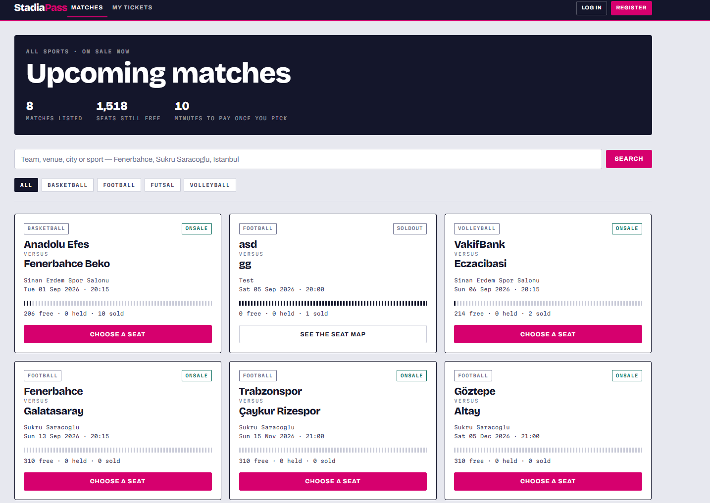 | 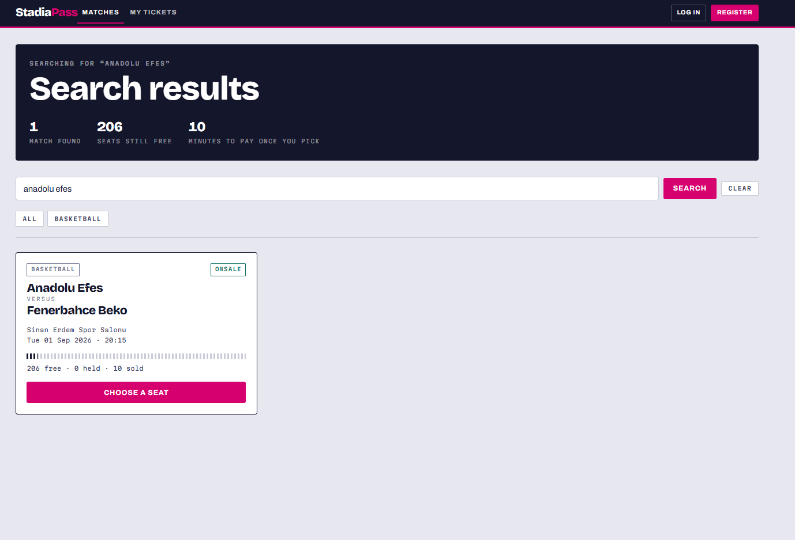 |

| Koltuk haritası — boş / tutulu / satılmış / senin | Ödeme — reddedilen kart tutmayı korur, geri sayım işler |
|---|---|
| 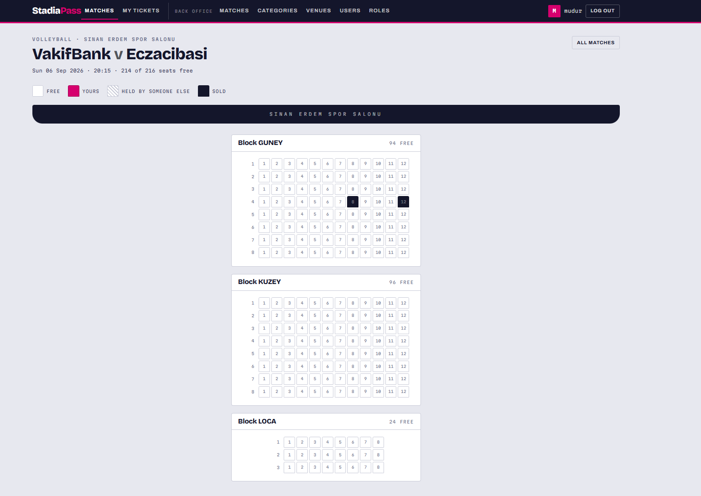 | 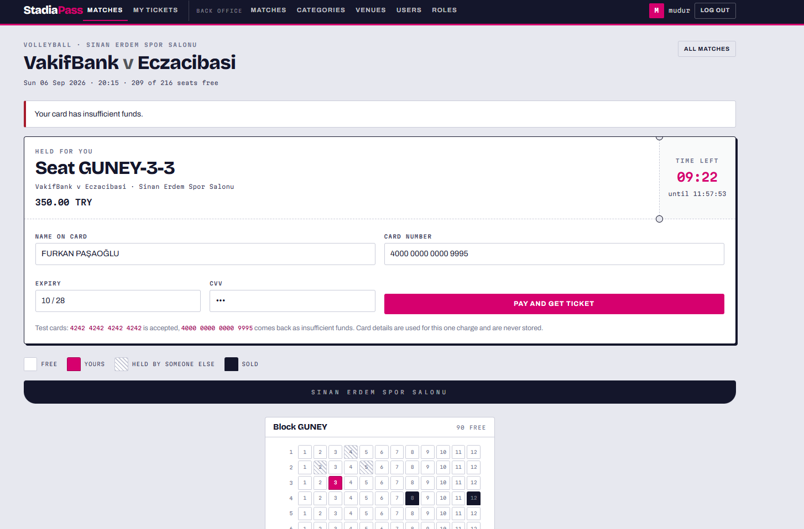 |

| Biletlerim — perfore koçan, erişim kodu, fiyat anlık görüntüsü |
|---|
| 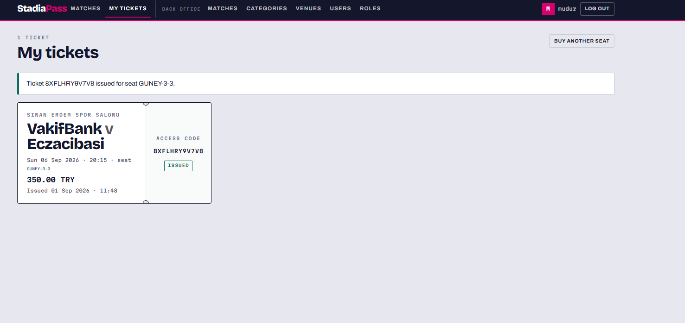 |

### Back office

| Satıştaki fikstürler — iptal, her bileti iade eder | Roller & izinler — checklist, izin kataloğundan reflection'la çizilir |
|---|---|
| 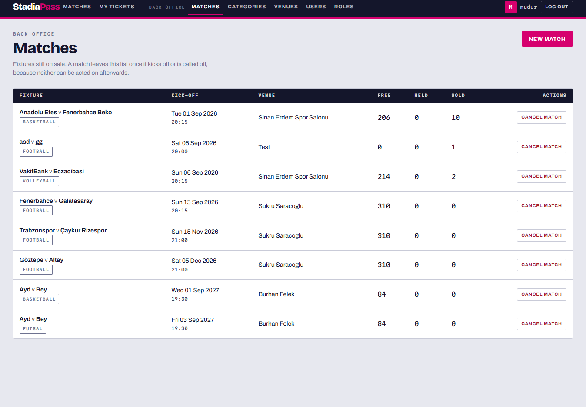 | 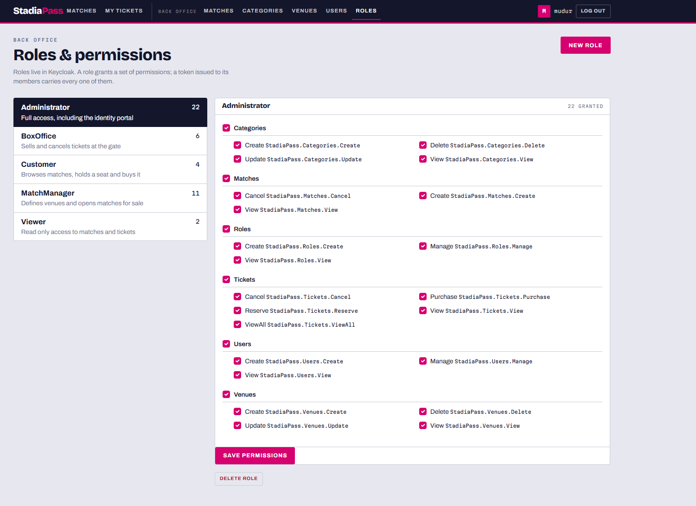 |

<details>
<summary><b>Diğer back-office ekranları</b> — mekânlar ve oturma planları, kategoriler, kullanıcılar ve oluşturma formları</summary>
<br>

| Mekânlar — bloklar, fiyat çarpanları, dondurulmuş planlar | Yeni mekân — maçın somutlaştırdığı oturma planı |
|---|---|
| 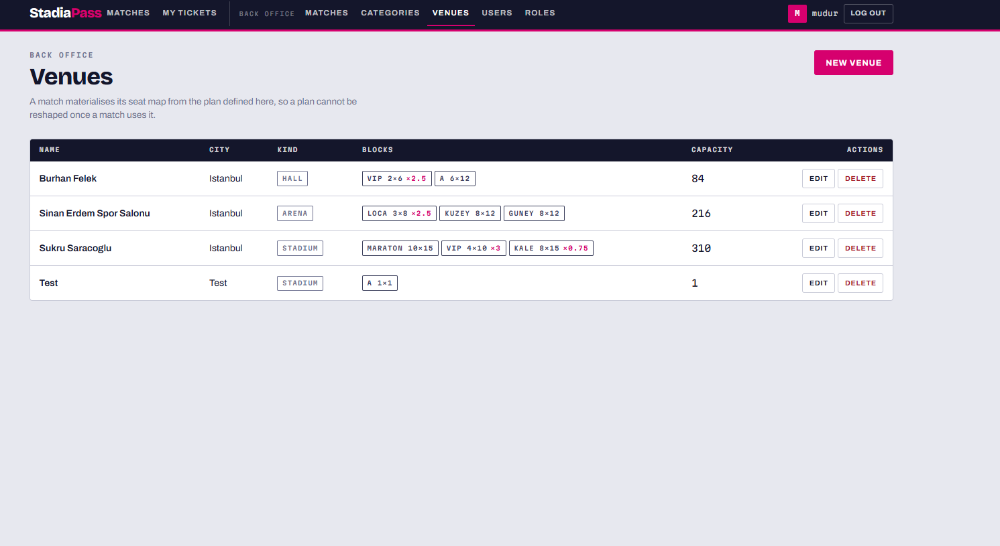 | 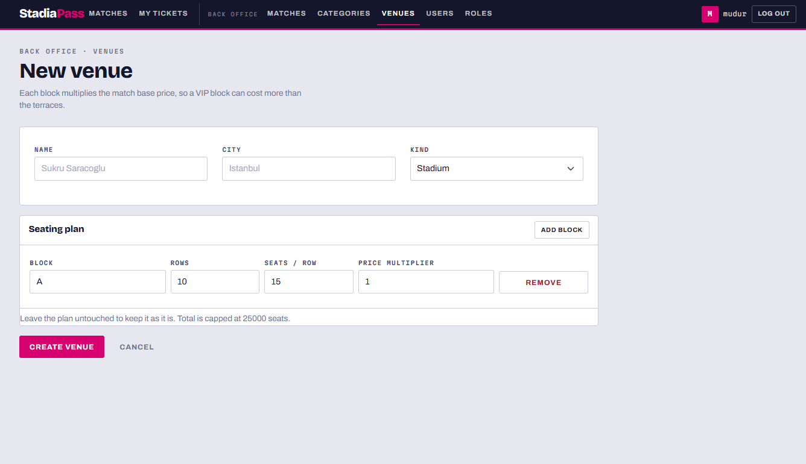 |

| Spor kategorileri — her biri hangi mekân türlerinde oynanır | Yeni kategori |
|---|---|
| 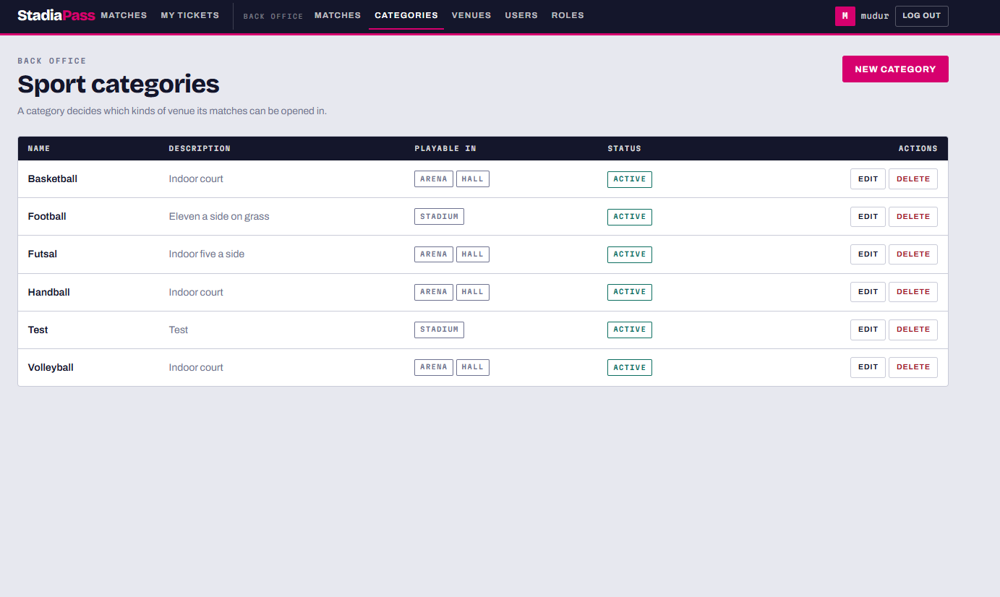 | 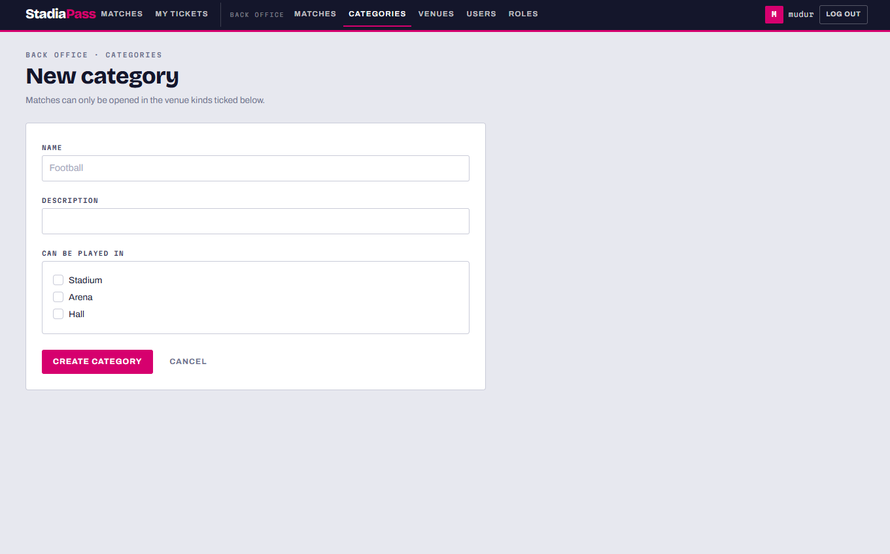 |

| Maç oluştur — mekânın bütün planı koltuğa dönüşür | Yeni rol — burada işaretlenen izinler Keycloak composite'i olur |
|---|---|
| 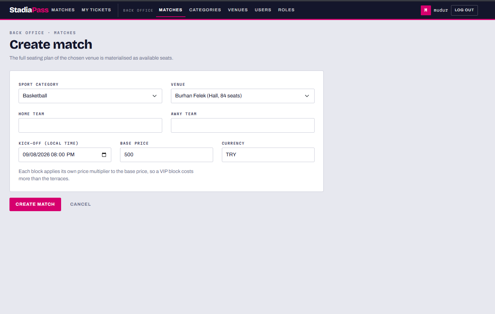 | 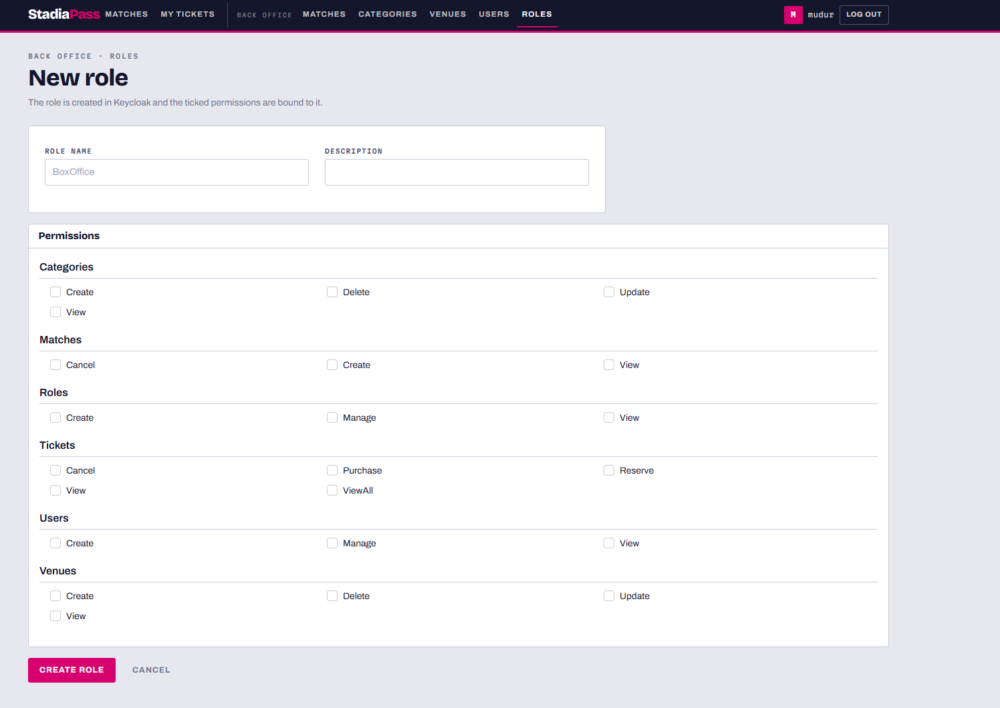 |

| Kullanıcılar — hesaplar Keycloak'ta yaşar, API aracılık eder | Yeni kullanıcı |
|---|---|
| 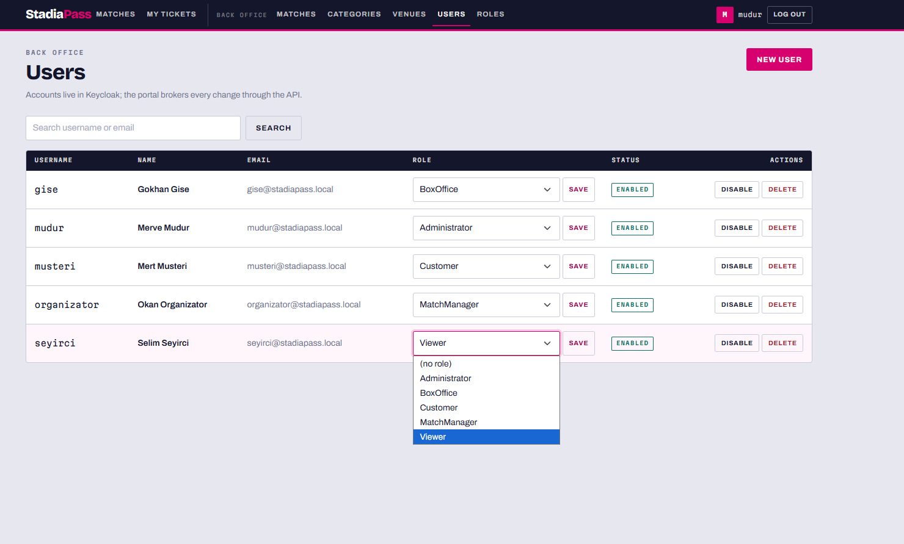 | 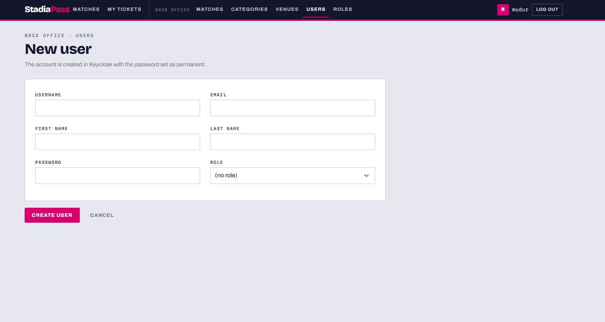 |

</details>

## 🏗️ Mimari

```
StadiaPass.slnx
├── src
│   ├── Shared
│   │   ├── StadiaPass.SharedKernel            # izin sözlüğü, framework bağımlılığı yok
│   │   └── StadiaPass.SharedKernel.AspNetCore # dinamik policy provider + claims transformation
│   ├── Core
│   │   ├── StadiaPass.Domain        # aggregate'ler, value object'ler, domain event'ler
│   │   └── StadiaPass.Application   # CQRS use case'leri, doğrulama, portlar
│   ├── Infrastructure
│   │   ├── StadiaPass.Persistence   # EF Core 10 + PostgreSQL, outbox/inbox, repository'ler
│   │   └── StadiaPass.Infrastructure# adaptörler: ödeme, mesajlaşma, arama, mail, kilit
│   └── Presentation
│       ├── StadiaPass.WebAPI        # Minimal API + Scalar referansı
│       ├── StadiaPass.WebMVC        # Razor MVC — API'yi yalnızca HTTP üzerinden tüketir
│       ├── StadiaPass.McpServer     # Model Context Protocol sunucusu — katalog, AI istemcileri için
│       └── StadiaPass.AgentHost     # analist ajan — aynı tool'ları tutan yerel bir model
├── orchestrator
│   ├── StadiaPass.AppHost           # Aspire: Postgres, Redis, RabbitMQ, Keycloak, Elastic, Vault, Grafana
│   └── StadiaPass.ServiceDefaults   # Vault config, Serilog, OpenTelemetry, health check'ler
└── tests                            # Domain.UnitTests · Application.UnitTests · AgentHost.Evals
```

```
WebMVC ────HTTP──► WebAPI ──► Application ──► Domain
McpServer ─HTTP──►   │             ▲
                     └──► Persistence / Infrastructure (soyutlamaları uygular)
AgentHost ──MCP──► McpServer ─HTTP──► WebAPI           (ajan, bir istemcinin istemcisidir)
WebMVC ───────────► SharedKernel ◄── WebAPI            (yalnızca izin sözleşmeleri)
```

`Domain`, `MediatR.Contracts` (işaretleyici arayüzler) dışında hiçbir şeye bağımlı değil. `WebMVC` asla
`Domain` ya da `Application` referans almaz — tıpkı üçüncü taraf bir istemci gibi saf bir API tüketicisidir.
API ile paylaştığı tek şey izin sözlüğüdür; o da `SharedKernel`'de yaşar, böylece iki taraf da kendi başına
bir izin dizgisi uyduramaz. `McpServer` da aynı kurala aynı gerekçeyle tabidir — iş mantığının sahibi tek
process'tir, geri kalan herkes ona HTTP üzerinden konuşur. `AgentHost` bir adım daha dışarıda durur: kural
değil model tutar ve sisteme yalnızca her AI istemcisinin kullandığı MCP tool'ları üzerinden uzanır.

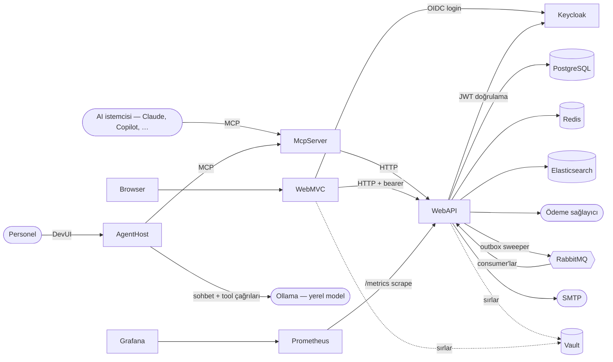
```mermaid
flowchart LR
  Browser --> WebMVC
  AI([AI istemcisi — Claude, Copilot, …]) -->|MCP| McpServer
  Personel([Personel]) -->|DevUI| AgentHost
  AgentHost -->|MCP| McpServer
  AgentHost -->|sohbet + tool çağrıları| Ollama([Ollama — yerel model])
  McpServer -->|HTTP| WebAPI
  WebMVC -->|HTTP + bearer| WebAPI
  WebMVC -->|OIDC login| Keycloak
  WebAPI -->|JWT doğrulama| Keycloak
  WebAPI --> Postgres[(PostgreSQL)]
  WebAPI --> Redis[(Redis)]
  WebAPI --> Elastic[(Elasticsearch)]
  WebAPI --> Stripe([Ödeme sağlayıcı])
  WebAPI -->|outbox sweeper| Rabbit{{RabbitMQ}}
  Rabbit -->|consumer'lar| WebAPI
  WebAPI --> SMTP([SMTP])
  WebAPI -.sırlar.-> Vault[(Vault)]
  WebMVC -.sırlar.-> Vault
  Prometheus -->|/metrics scrape| WebAPI
  Grafana --> Prometheus
```

### Domain modeli

| Aggregate | Koruduğu kurallar |
|---|---|
| `SportCategory` | en az bir oynanabilir mekân türü, benzersiz ad, pasif kategori yeni maç kabul etmez |
| `Venue` | en az bir blok, benzersiz blok adları, 25.000 koltuk tavanı, bir maç kullandığı anda plan dondurulur |
| `Match` | takımlar farklı, başlama vuruşu gelecekte, kategori mekân türünde oynanabilir, koltuklar plandan üretilir, sayaçlar ve `SoldOut` tutarlı, **başlama vuruşu geçtikten sonra hiçbir koltuk el değiştirmez** |
| `MatchSeat` | `Available` → `Reserve()` → `ConfirmSale()`, 10 dakikalık tutma, yalnızca tutan satın alabilir, süresi dolan tutmalar kendiliğinden bırakılır, `Sold`'dan geri dönüşün tek yolu `VoidSale()` |
| `Ticket` | yalnızca maçın çoktan `Sold`'a taşıdığı bir koltuk için kesilir, ödeyen çekimi her zaman kaydeder, koltuk başına en fazla bir canlı bilet |

Koltuk geçişleri **yalnızca** maç üzerinden sürülür: `MatchSeat.Reserve/ConfirmSale/Release` `internal`
olduğundan tek giriş noktaları `Match.ReserveSeat(...)` ve `Match.ConfirmSeatSale(...)`'dir ve sayaçlar
saydıkları koltuklardan asla sapamaz. Her setter `private`; kural ihlalleri `DomainRuleViolationException`
fırlatır, API bunu `422`'ye çevirir.

## 🎫 Koltuk satın alma

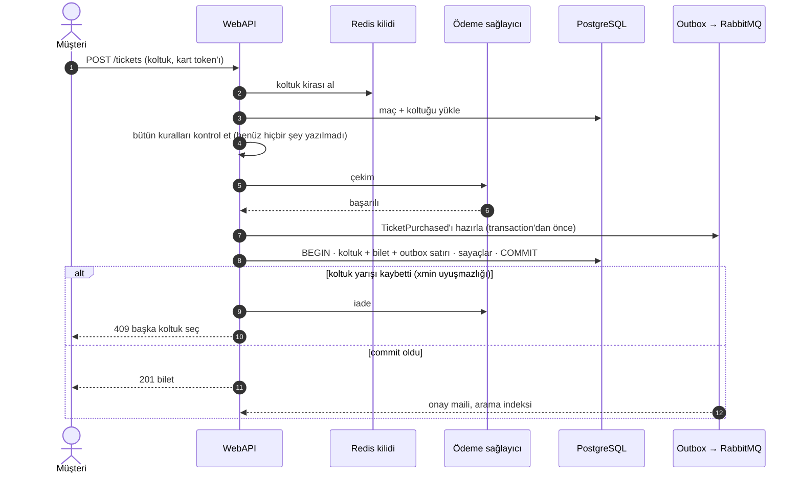
```mermaid
sequenceDiagram
  autonumber
  actor C as Müşteri
  participant API as WebAPI
  participant R as Redis kilidi
  participant P as Ödeme sağlayıcı
  participant DB as PostgreSQL
  participant OB as Outbox → RabbitMQ

  C->>API: POST /tickets (koltuk, kart token'ı)
  API->>R: koltuk kirası al
  API->>DB: maç + koltuğu yükle
  API->>API: bütün kuralları kontrol et (henüz hiçbir şey yazılmadı)
  API->>P: çekim
  P-->>API: başarılı
  API->>OB: TicketPurchased'ı hazırla (transaction'dan önce)
  API->>DB: BEGIN · koltuk + bilet + outbox satırı · sayaçlar · COMMIT
  alt koltuk yarışı kaybetti (xmin uyuşmazlığı)
    API->>P: iade
    API-->>C: 409 başka koltuk seç
  else commit oldu
    API-->>C: 201 bilet
    OB-->>API: onay maili, arama indeksi
  end
```

Sıralama tasarımın kendisi. Kurallar karta dokunulmadan **önce** koşar, çünkü birinden para çekip ancak
ondan sonra tutmasının dolduğunu keşfetmek onu parası ödenmiş ama koltuksuz bırakır. Sayaçları veritabanı
hesaplar (`sold = sold + 1`) ve **en son** yazılırlar — maç satırı sistemdeki en kaba kilittir, o yüzden
bütün transaction boyunca değil yalnızca commit için tutulur; çekişme altında ölçüldü, en sona almak en
başa almanın **1,9 katı** throughput verdi. Para gittiği hâlde satış olmadığında ise iade, hata yoluna
devam etmeden koşar: iadenin kendisi de başarısız olursa outbox'a bir `RefundOwedEvent` yazılır ve broker
yeniden dener — borç bir satırdır, birinin fark etmesi gereken bir log satırı değil.

## 🔥 Fikstürü iptal etmek

```
CancelMatchCommand ── tek küçük transaction: status=Cancelled · tutulu koltukları bırak · 2 outbox satırı
        │
        ├─► MatchCatalogueChangedEvent ──► fikstür arama indeksinden çıkar
        │
        └─► MatchCancelledEvent ──► satılmış her bilet için ayrı scope, broker üzerinde:
                koltuğu void et · bileti iptal et · iadeyi borç yaz · bildirimi kuyruğa koy   (her biri tek transaction)
                        └─► sağlayıcıya iade  +  "paranız yolda" maili
```

Senkron yarı bilerek minicik: gişeyi kapatır ve tutulu koltukları geri verir, o kadar. Yüzlerce bileti geri
ödemek broker'ın işidir; orada her bilet kendi başına yeniden dener ve kötü bir öğleden sonra geçiren bir
sağlayıcı iptali geri alamaz. Her yerleşim kendi ödemesiyle adreslenir ve yalnızca hâlâ canlı olan bir bilet
bulur; bu yüzden yeniden teslim no-op'tur ve yarım kalmış bir geçiş kaldığı yerden devam eder.

## 🤖 MCP sunucusu ve analist ajan — katalog, AI istemcileri için

`StadiaPass.McpServer`, herkese açık kataloğu
[Model Context Protocol](https://modelcontextprotocol.io) üzerinden yayınlar — AI asistanlarının (Claude,
Copilot, MCP konuşan her şey) tool keşfedip çağırdığı standart. Bir tanesini bağlayın: "bu hafta sonu
Fenerbahçe maçı var mı, en ucuz koltuk kaç para?" iki tool çağrısına ve bir cevaba dönüşür — hem de
tarayıcının kullandığı API'nin aynısına karşı.

| Tool | Cevapladığı | Arkasındaki |
|---|---|---|
| `get_upcoming_matches` | satışta ne var, canlı koltuk sayılarıyla | `GET /api/v1/matches` |
| `search_matches` | takıma, mekâna, şehre ya da spora göre fikstür — ve index'e ulaşılamadığında bunu yüksek sesle söyler, çağıranın düz listeye baktığını gizlemez | `GET /api/v1/matches/search` |
| `get_seat_availability` | kalan koltuk, en ucuz fiyat, blok başına sayılar ve fiyat aralıkları | `GET /api/v1/matches/{id}/seats` |

Bu projeyi üç karar taşıyor:

- **İçinde model yok.** Zekâ, bağlanan ve tool açıklamalarını okuyan istemciye aittir; sunucu, maliyet
  profili herhangi bir API yüzeyiyle aynı olan bir tool katmanıdır. Onu model-bağımsız kılan da budur —
  bugün çağıran istemci bir taahhüt değildir.
- **API'nin istemcisidir, tıpkı portal gibi.** Veritabanı yok, broker yok, sır yok — Application katmanını
  doğrudan host etmek, yalnızca tek process'te çalışması gereken mesaj consumer'larını ve arama index
  worker'larını da beraberinde sürüklerdi.
- **Özet döner, döküm değil — ve bilerek salt-okuma.** Tool çıktısı çağıranın context penceresine düşer ve
  çağıranın token'ını harcar; bu yüzden koltuk haritası tool'u on binlerce koltuğu blok başına sayılara ve
  fiyat aralıklarına katlar. Yalnızca üç anonim endpoint açıktır: yazmalar, gerçek bir kullanıcının
  kimliğini, bir onay adımını ve bir idempotency anahtarını taşıyabilecekleri güne kadar bekler — kart
  numarasının bir dil modelinden geçmekte hiçbir işi yoktur, o yüzden bir satın alma tool'u asla olmayacak.

AppHost çalışırken deneyin: `npx @modelcontextprotocol/inspector` → Streamable HTTP →
`http://localhost:5299/mcp`; ya da bir asistana `claude mcp add --transport http stadiapass
http://localhost:5299/mcp` ile verin ve doğal dille sorun — Türkçe de çalışır, çünkü cümleyi model,
terimi ise `search_matches`'in arkasındaki Türkçe analyzer anlar.

**Aynı tool'lar, ikinci bir tüketici.** `StadiaPass.AgentHost`, personel için kurum içi bir analist:
**yerel** bir modelin (Ollama `qwen2.5:14b`, sıcaklık 0) önünde duran bir
[Microsoft Agent Framework](https://learn.microsoft.com/agent-framework/) host'u; aynı üç tool'u ikinci bir
MCP istemcisi olarak tüketir. O var olsun diye altındaki hiçbir şey değişmedi. Kural değil model tutar: adı
ve tipli parametreleri olan tool'lar arasından seçer, sorgu yazmaz; talimatları da `AnalystAgent` içinde
yaşar — hem host hem eval'ler oradan okur, yani puanlanan dizgi çalıştırdığı dizgidir. `IChatClient`
dikişinin üstündeki her şey sağlayıcı-bağımsız; bulut modeli demek Vault'ta bir anahtar ve tek bir kayıt
satırı demek. Sohbet arayüzü: `/devui`, yalnızca geliştirmede.

**Ajan beğenilmez, ölçülür.** Model aynı soruya her seferinde farklı cevap verir; bu yüzden kendi takımı
var: Türkçe ve İngilizce **22 puanlanan vaka**, modelin kabul edilebilir argümanlarla kabul edilebilir bir
tool'a uzandığını — ya da sohbet muhabbetinde hiçbir tool çağırmadığını — doğrular. Tool adları ve şemaları
gerçek `CatalogueTools`'tan reflection'la gelir; böylece eval, ölçtüğü yüzeyden kayamaz ve hiçbir şey
çalıştırılmaz. Opsiyoneldir, çünkü yirmi model çağrısının 200 ms'lik bir test döngüsünde işi yok:

```powershell
$env:STADIAPASS_RUN_EVALS = "1"; dotnet test
```

## 📐 Mimari kararlar

Her satır bir bedeli olmuş bir karardır ve çoğu, hayal edilen değil **ölçülen** bir hatanın üstüne var.

| Karar | Neden | Neyi önlüyor |
|---|---|---|
| **Domain hiçbir şeye bağımlı değil** | Kurallar veritabanı, broker ya da web host olmadan test edilebilir | 57 domain testi 60 ms'de koşar ve altyapı tarafından kırılamaz |
| **WebMVC, API ile yalnızca HTTP üzerinden konuşur** | API'nin tek bir çağıranın konforu değil gerçek bir sözleşme olduğunu kanıtlar | Ön yüzün sessizce `Application`'a uzanıp API'yi süs bırakması |
| **Koltukta iyimser eşzamanlılık (`xmin`)** | Aynı koltuğun iki satışı birden commit olamaz | Bir koltuğu iki kez satmak; kaybeden otomatik iade alır |
| **Sayaçlar göreli `UPDATE`, maç satırı en sonda** | Toplamları istek değil veritabanı hesaplar | Kayıp güncellemeler ve kilit konvoyu — 1,9× throughput ölçüldü |
| **Ödemenin kapısında Redis kirası** | Kaybedeni kart çekilmeden geri çevirir | Hiç alamayacağı bir koltuk için birinin ekstresinde bir çekim ve bir iade |
| **Transactional outbox** | Mesaj ve satış tek `SaveChanges` paylaşır | Kimseye haber verilmeden satılmış bir bilet; ya da geri alınan bir satışın maili |
| **Sağlayıcı webhook'ları için inbox** | Sağlayıcılar en az bir kez teslim eder | Aynı webhook'un iki kez iade yapması |
| **Idempotency anahtarı koltuğu değil denemeyi adlandırır** | Sağlayıcılar farklı parametreli tekrar anahtarı reddeder | Denenen ilk kartın sonraki her kartın cevabını belirlemesi — ve koltuğu 24 saat kilitlemesi |
| **Kart asla saklanmaz** | Yalnızca sağlayıcı token'ı çekilir; kart alanları her logda maskelidir | PAN saklamanın sürükleyeceği bütün PCI kapsamı |
| **Elasticsearch yalnızca arama için** | Liste PostgreSQL'de kalır ve asla bayat değildir | Koltuk haritasıyla çelişen bir okuma modeli; arama kesintisinin site kesintisine dönüşmesi |
| **`asciifolding`, Türkçe stemmer'dan önce** | Yoksa `Fenerbahçe` ile `fenerbahce` farklı stem'lere düşer | Türkçe karakteri olmayan ziyaretçinin hiçbir şey bulamaması |
| **Satışı durum değil saat kapatır** | Bir durumu birinin set etmesi gerekir ve o şey gecikebilir | Çoktan oynanmış bir maça bilet satmak |
| **İptalin kendi izni var** | Para harcayan tek eylem | Maç açabilenin otomatik olarak bir stadyum dolusu hasılatı iade edebilmesi |
| **Rolleri Keycloak, izinleri kod tutar** | Rol adları realm'de, izin dizgileri `SharedKernel`'de yaşar | İki tarafın aynı hakkın farklı yazımlarını uydurması |
| **Sırlar için Vault, fallback yok** | Sır taşıyan option'lar `[Required]` + `ValidateOnStart` | Birisi yapılandırmayı unuttuktan sonra sessizce çalışmaya devam eden bir varsayılan |
| **Ajana tool verilir, connection string asla** | Tipli bir yüzeyden seçim gözden geçirilebilir; üretilen SQL geçirilemez | Modelin kimsenin açmayı düşünmediği bir kolona uzanması ve bir iş kuralının prompt'ta yaşaması |

### Bilerek yapılmayanlar

| Yapılmadı | Neden |
|---|---|
| **Saga / process manager** | İki katılımcı var — sağlayıcı ve tek bir PostgreSQL transaction'ı — ve koltuk, sayaç, bilet zaten atomik. Saga, çözecek tutarlılık sorunu kalmamışken bir koordinatör ekler ve istemcinin bağımlı olduğu senkron `201`/`409` cevaplarına mal olurdu. |
| **Aramada facet / agregasyon** | Amaç analyzer, alaka ve typo toleransıydı; faceting daha fazla öğrenme getirmeden daha fazla Elasticsearch yüzeyi demek. |
| **Hangfire / Quartz** | Bir avuç periyodik iş bir zamanlayıcıyı ve deposunu haklı çıkarmaz; tek-instance çalıştırmayı zaten `FOR UPDATE SKIP LOCKED` çözüyor. |
| **Kubernetes manifest'leri** | `/health` ve `/alive` bir orkestratörün sorduğu iki soruyu zaten cevaplıyor; hiçbir cluster'a karşı yazılmış bir manifest, kimsenin size söyleyemeyeceği şekillerde yanlıştır. |
| **Sekiz ince handler'a test** | Tek bir repository çağrısını iletiyorlar; test, mock'un çağrıldığını doğrular, implementasyonu kilitler ve hiçbir hata yakalayamazdı. |
| **Zaman dilimi modeli** | Sunucunun yerel saatiyle yazılıp okunuyor — simetrik, ama `TZ=UTC` konteynerinde Türk ziyaretçi saatleri üç saat kayık görür. Biliniyor, kabul edildi. |

## 🛠️ Teknoloji yığını

| Katman | Teknoloji | Sürüm | Buradaki işi |
|---|---|---|---|
| Runtime | .NET / C# | 10 / 14 | çözüm genelinde `uyarılar hata` ve nullable açık |
| Orkestrasyon | .NET Aspire | 13.5.2 | her bağımlılığı başlatır, bağlantı dizgilerini bağlar, dashboard |
| API | ASP.NET Core Minimal API | 10.0.11 | `MapGroup` + `IEndpoint` keşfi, Scalar referans arayüzü |
| AI yüzeyi | ModelContextProtocol.AspNetCore | 2.2.0 | streamable HTTP üzerinden MCP sunucusu, üç salt-okuma katalog tool'u |
| Ajan | Microsoft Agent Framework | 1.20.0 | analist host'u, OpenAI uyumlu endpoint'leri ve DevUI |
| Model erişimi | Microsoft.Extensions.AI + OllamaSharp | 10.9.0 / 5.4.30 | sağlayıcı-bağımsız `IChatClient`, yerel `qwen2.5:14b`, GenAI telemetrisi |
| Arayüz | ASP.NET Core MVC + Razor | 10.0.11 | sunucuda render, elle yazılmış tek stylesheet |
| Use case'ler | MediatR + FluentValidation | 12.5.0 / 12.1.1 | komutlar, sorgular, pipeline behavior'ları |
| Kalıcılık | EF Core + Npgsql → PostgreSQL 17 | 10.0.11 | aggregate'ler, owned type'lar, `xmin` token'ı, outbox ve inbox tabloları |
| Önbellek / kilit | Redis | latest | 15 saniyelik liste önbelleği, `SET NX PX` koltuk kirası |
| Mesajlaşma | MassTransit + RabbitMQ | 8.5.10 | consumer'lar, retry politikası (5 deneme, 1 sn → 30 sn), hata kuyrukları |
| Arama | Elasticsearch | 9.x | Türkçe analyzer, search-then-fetch |
| Kimlik | Keycloak | latest | OIDC girişi, JWT, realm'de tutulan roller |
| Ödeme | Stripe.NET | 52.3.0 | token'lı çekim, iade, imzalı webhook'lar |
| Mail | MailKit | 4.17.0 | bilet onayı, iptal bildirimi |
| Sırlar | HashiCorp Vault | 1.21 | açılışta konfigürasyon olarak enjekte edilir |
| Telemetri | OpenTelemetry + Serilog | 1.15 / 10.0 | trace'ler, metrikler, yapılandırılmış loglar |
| Panolar | Prometheus + Grafana | 3.6 / 12.2 | scrape edilen metrikler, provision edilmiş paneller ve alarm kuralları |
| Testler | xUnit, NSubstitute, FluentAssertions | 2.9 / 5.3 / 7.2 | 207 test, artı 22 opsiyonel ajan eval'i |

**Koddaki desenler:** Clean Architecture · DDD aggregate'leri · domain event'ler · CQRS · pipeline
behavior'ları · repository + unit of work · portlar ve adaptörler · transactional outbox · idempotent inbox ·
telafi eden eylem · iyimser eşzamanlılık · dağıtık kilit · search-then-fetch projeksiyonu · options
doğrulaması · `PeriodicTimer` üzerinde arka plan worker'ları.

## 🔐 Güvenlik

Kimlik doğrulama Keycloak'a devredilmiştir; yetkilendirme **izin tabanlı ve tamamen dinamiktir** — kodun
hiçbir yerinde rol adı geçmez.

- İzin dizgisinin bildirildiği tek yer `StadiaPassPermissions`'tır (SharedKernel); policy'ler özel bir policy
  provider tarafından talep anında kurulur, `AddPolicy(...)` hiç elle yazılmaz.
- Keycloak realm rolleri composite'tir: `BoxOffice` gibi bir iş rolü izin rollerine açılır ve claims
  transformation uygulamanın bildirmediği her şeyi düşürür — Keycloak'a rol eklemek erişimi sessizce
  genişletemez. Portaldaki rol editörü kataloğu reflection'la çizer; yeni bir izin sabiti hiçbir UI değişikliği
  olmadan checkbox olarak belirir.
- `Matches.Cancel` bilerek kendi iznidir ve yalnızca `Administrator` taşır: para harcayan tek eylem odur.
- Kart asla saklanmaz ve asla loglanmaz — bir destructuring policy, adı sır gibi görünen her üyeyi olay
  yazılmadan önce maskeler. Yalnızca `sk_test_` Stripe anahtarları kabul edilir; aksi açılışta reddedilir.
- Webhook ucu zorunlu olarak anonimdir ve tamamen HMAC imzasıyla savunulur; doğrulanamayan her şey
  reddedilir, eksik başlık dahil.
- Her sır Vault'ta yaşar ve sıradan konfigürasyon olarak gelir; sır taşıyan option'ların varsayılanı yoktur
  ve gece yarısı değil açılışta patlarlar.

## 📊 Gözlemlenebilirlik

Loglamayı iki uygulamada da Serilog yönetir (konsol + Aspire dashboard'una OTLP), istek başına tek
request-log satırı düşer ve MediatR komutu ürettiği her olayın üstüne destructure edilir. Prometheus
`/metrics`'i 5 saniyede bir scrape eder ve Grafana — veri kaynağı, dashboard ve iki alarm kuralı — depodaki
dosyalardan provision edilir; taze bir klonun panelleri çalışır hâlde gelir.

Jenerik runtime seti yerine *bu sistem için* yazılmış sayılar:

| Metrik | Neden bir insan gerektiriyor |
|---|---|
| `stadiapass_outbox_dead` / `stadiapass_inbox_dead` | sweeper'ın vazgeçtiği mesajlar. Inbox satırı daha kötüdür: sağlayıcıya `200` denmiştir ve bir daha asla göndermeyecektir — kimsenin uygulamadığı bir chargeback. `> 0`'da alarm. |
| `stadiapass_outbox_pending` / `inbox_pending` | düşmüş bir broker, bozuk bir consumer ve durmuş bir sweeper dışarıdan aynı görünür: tırmanan ve geri inmeyen bir sayı |
| arama süresi histogramı (`outcome` etiketiyle) | gecikme ve fallback sayısı tek enstrümanda — kova sınırları açıkça verilmiş, çünkü .NET'in varsayılanları milisaniye ölçeğinde ve 20 ms'lik p95'i "5 saniye" okur |
| indekslenmiş vs indekslenebilir maçlar | ses çıkarmayan tek arama arızası: *ayakta ama boş* bir indeks her sorguya hiçlikle cevap verir |
| `gen_ai.client.token.usage` · `gen_ai.client.operation.duration` | bir sorunun kaça ve ne kadar sürede mal olduğu, model kırılımında — OpenTelemetry'nin GenAI convention'ları altında, ajan host'undan diğer her servis gibi scrape edilir. Prompt ve cevaplar bilerek kaydedilmez: bir soru müşterinin adını taşıyabilir. |

## ✅ Testler

**207 test** — 57 domain, 150 application — veritabanı, broker ya da ağ olmadan yaklaşık 200 ms'de koşuyor.

Nasıl yazıldıklarına dair iki şey sayının kendisinden daha değerli:

- **Gerçek aggregate'ler, mock'lanmış portlar.** Domain'i stub'layan bir handler testi, korumak zorunda
  olduğu kural hakkında hiçbir şey kanıtlamazdı; bu yüzden maç gerçekten kurulur ve yalnızca repository,
  saat, unit of work ve çağıran yerine sahte konur.
- **Her testin düşebildiği kanıtlandı.** Her davranış için üretim kodu bilerek bozuldu ve eşleşen test
  düşerken izlendi — outbox save'den sonra hazırlandı, sayaç önce yazıldı, bir guard tersine çevrildi, bir
  filtre kaldırıldı. Hiç düşmemiş bir testin bir şeyi test ettiği gösterilmemiştir.

Kapsanmayanlar: kalıcılık katmanı, MVC view'ları ve tek çağrı ileten sekiz ince handler. Onlar çalışan
uygulamada gezinerek sınanıyor — bkz. [Senaryolar](#-senaryolar).

```powershell
dotnet test
```

## 🚀 Çalıştırma

.NET 10 SDK ve bir konteyner runtime'ı (Docker Desktop ya da Podman) gerekir.

```powershell
dotnet run --project orchestrator/StadiaPass.AppHost
```

Aspire; PostgreSQL (pgAdmin ile), Redis (RedisInsight ile), RabbitMQ (yönetim eklentisiyle), Elasticsearch,
Keycloak, Vault, Prometheus, Grafana, API, MVC uygulaması, MCP sunucusu ve ajan host'unu başlatır. İlk
açılışta şema kurulup tohumlanır ve Keycloak realm'i içe aktarılır.

| Kaynak | Yerel adres |
|---|---|
| MVC arayüzü | http://localhost:5230 |
| API + Scalar referansı | http://localhost:5042 · `/scalar/v1` |
| MCP endpoint'i | http://localhost:5299/mcp |
| Ajan DevUI | http://localhost:5399/devui |
| Keycloak | https://localhost:8080 |
| Vault arayüzü | http://localhost:8200 |
| Prometheus · Grafana | http://localhost:9090 · http://localhost:3000 |
| RabbitMQ, Elasticsearch | portlar Aspire dashboard'unda kendi kaynaklarının üstünde |

**Ollama'ya yalnızca ajan ihtiyaç duyar** — `ollama pull qwen2.5:14b`, `http://localhost:11434` üzerinde;
Aspire konteyneri değil sizin kendi kurulumunuz, çünkü model bir koşudan uzun yaşaması gereken
gigabyte'lardır. O olmadan da her şey ayağa kalkar; cevap veremeyen tek şey ajan olur.

**Ödeme hiçbir yapılandırma istemez.** Sağlayıcı, Stripe'ın kendi test numaralarını izleyen bir mock'a
varsayılan olarak ayarlıdır: `4242 4242 4242 4242` başarılı olur, `4000 0000 0000 9995` anahtar ve ağ
olmadan reddedilir. Gerçeğini kullanmak için `PaymentProvider:Type=Stripe` ile bir `sk_test_…` anahtarı verin.

**Soğuk açılışın ilk saniyelerindeki `GET /health responded 503` sistemin çalışmasıdır**, arıza değil:
`/health` yalnızca her bağımlılık hazır olduğunda cevap verir ve API dinlemeye başlamışken RabbitMQ hâlâ
ayağa kalkıyordur. `/alive` farklı soruyu — "bu süreç hâlâ çalışıyor mu" — cevaplar, böylece broker'ın bir
hıçkırığı API'yi yeniden başlatmaz.

### Demo kullanıcılar

| Kullanıcı | Şifre | Rol | Yapabildiği |
|---|---|---|---|
| `mudur` | `mudur` | Administrator | her şey, maç iptali dahil |
| `organizator` | `organizator` | MatchManager | mekânlar, kategoriler, maç açmak |
| `gise` | `gise` | BoxOffice | koltuk tutmak ve satın almak, herkesin biletini okumak |
| `musteri` | `musteri` | Customer | gezinmek, tutmak, satın almak, kendi biletlerini okumak |
| `seyirci` | `seyirci` | Viewer | yalnızca okuma |

## 🎬 Senaryolar

Çalışan uygulamaya karşı yürüyüşler. Her biri birim testlerin yapamadığı bir şeyi sınıyor.

**1 · Koltuk al.** http://localhost:5230'u aç, bir maç seç, bir koltuk seç, `musteri`/`musteri` ile gir,
`4242 4242 4242 4242` · `12/30` · `123` ile öde. Beklenen: bir bilet, perfore koçan ekranı ve o koltuğun
haritada dolu mürekkebe dönmesi.

**2 · Reddedilen kart tutmayı korur.** Başka bir koltuk tut, `4000 0000 0000 9995` ile öde. Beklenen:
"insufficient funds" ve **koltuk hâlâ sende tutulu** — hiçbir şey yazılmadı, dolayısıyla geri alınacak bir
şey yok. Şimdi aynı koltuğu `4242 4242 4242 4242` ile öde. Beklenen: başarı. Gerçek bir Stripe anahtarına
karşı asıl önemli test budur: sabit bir idempotency anahtarı reddi tekrar oynatır ve koltuğu 24 saat
kilitlerdi.

**3 · İki tarayıcı, bir koltuk.** Aynı koltuğu iki tarayıcıda tut. Beklenen: ikincisi çekimden sonra değil,
daha kapıda geri çevrilir.

**4 · Terk edilmiş tutma geri döner.** Bir koltuk tut ve çek git. Beklenen: on dakikalık pencere dolduktan
sonraki bir dakika içinde koltuk yeniden müsait olur ve sayaçlar haritayla aynı fikirdedir.

**5 · Arama.** Yarım bir ad, yanlış bir yazım ve Türkçe bir adın ASCII yazımını (`fenerbahce`) yaz. Sonra
`search` konteynerini durdur ve yine ara. Beklenen: yaklaşık iki saniyede liste, aramanın kullanılamadığını
söyleyen bir notla — ve satın alma çalışmaya devam eder.

**6 · Maç iptal et.** `mudur` olarak **Matches**'a git, bileti satılmış bir fikstürü iptal et ve bir sebep
yaz. Beklenen: kaç biletin iade edileceğini söyleyen bir onay sayfası; fikstürün listeden **ve aramadan**
düşmesi; `musteri` olarak "Biletlerim"de koçanın *Maç iptal edildi* damgasıyla ve dönen tutarla görünmesi;
API loglarında bilet başına bir `settled after a cancellation` ve bir `Refunded` satırı.

**7 · Oynanmış maça bilet.** Bir koltuk haritası linkini sakla, başlama vuruşunun geçmesini bekle, yeniden
aç. Beklenen: harita çizilir ama hiçbir şey tutulamaz ve satın alınamaz.

**8 · Analiste sor.** Ollama çalışırken http://localhost:5399/devui adresini aç ve *"Fenerbahçe maçında en
ucuz koltuk kaç para?"* diye sor. Beklenen: iki tool çağrısı — `search_matches`, ardından az önce bulduğu
id ile `get_seat_availability` — ve diğer sekmedeki koltuk haritasıyla uyuşan bir fiyat.

---

[MIT Lisansı](LICENSE) ile lisanslanmıştır.
